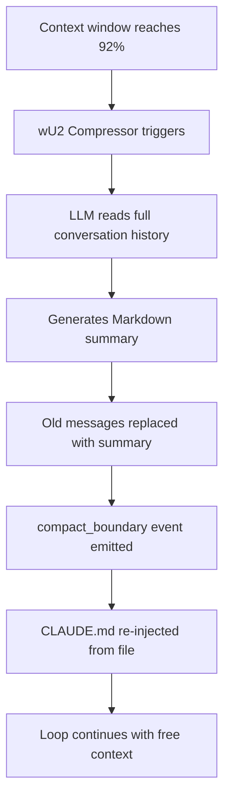
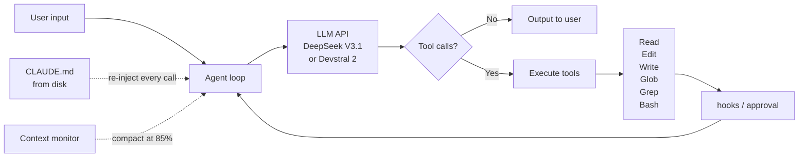

# Claude Code

Claude Code is the most widely-deployed agentic coding assistant in production as of 2026. It launched as a research preview in [February 2025](https://www.anthropic.com/news/claude-4) and became generally available in [May 2025](https://www.anthropic.com/news/claude-4) alongside the Claude 4 model family. By February 2026, it represented [nearly 20% of Anthropic's business — over $2.5 billion in annual revenue](https://www.wired.com/story/openai-codex-race-claude-code/), making it one of the fastest-growing developer tools ever shipped. In [Anthropic's own words](https://www.anthropic.com/news/introducing-anthropic-labs): it "grew from a research preview to a billion-dollar product in six months."

This page follows the [five-layer methodology](index.md#methodology-the-five-layer-stack) from the overview. You have already read [Internals](../internals.md) — every section here builds directly on that vocabulary. When you see references to "the agent loop," "full replay model," or "orchestration tax," those are the mechanics from [Internals § 1](../internals.md#1-the-agent-loop), [§ 3](../internals.md#3-state-and-memory-serialization), and [§ 6](../internals.md#6-the-orchestration-tax) respectively.

---

## 1. Observable Behavior

### 1.1 The CLI Interface

Claude Code is a terminal-based interactive REPL installed via a one-line shell command ([Claude Code terminal guide](https://code.claude.com/docs/en/terminal-guide)):

```bash title="Installation"
# macOS / Linux
curl -fsSL https://claude.ai/install.sh | bash

# Then invoke inside a project directory
claude
```

Once running, the interface renders GitHub-flavored Markdown in a monospace terminal. You type natural language, Claude responds and/or executes tool calls, and the loop continues until you exit. Key controls:

- `Esc` — interrupt current task
- `Ctrl+C` — exit entirely
- `Tab` — toggle thinking mode (extended reasoning budget)
- `Ctrl+B` — launch a background sub-agent
- `Shift+Enter` — multi-line input (requires `/terminal-setup` to configure)

[As of May 2025](https://www.anthropic.com/news/claude-4), Claude Code also ships as native extensions for VS Code and JetBrains, where proposed file edits appear inline in the IDE diff view. The Desktop app, web, and iOS surfaces all connect to the same underlying engine.

### 1.2 Tool Inventory

The complete built-in tool set, confirmed via the [published system prompt](https://gist.github.com/chigkim/1f37bb2be98d97c952fd79cbb3efb1c6) and [official SDK documentation](https://platform.claude.com/docs/en/agent-sdk/agent-loop):

| Tool | Category | Description |
|------|----------|-------------|
| `Read` | File | Read file contents; supports images, PDFs, Jupyter notebooks (up to ~2,000 lines by default) |
| `Edit` | File | Exact string replacement — `old_string → new_string` |
| `Write` | File | Overwrite entire file |
| `Glob` | Search | Fast file pattern matching (e.g., `**/*.py`) |
| `Grep` | Search | Regex content search across files (powered by ripgrep) |
| `Bash` | Execution | Run shell commands in a **persistent** shell session |
| `WebFetch` | Web | Fetch and process web page content via a lightweight model pass |
| `WebSearch` | Web | Web search with mandatory source citation in response |
| `LS` | Discovery | List directory contents with metadata |
| `TodoWrite` | Orchestration | Manage a structured task list (pending/in_progress/completed); renders as a live checklist in the terminal |
| `AskUserQuestion` | Orchestration | Ask clarifying questions with multi-choice options |
| `Agent` | Orchestration | Spawn a sub-agent with its own context window and tool set |
| `Skill` | Orchestration | Invoke a user-defined slash command workflow |
| `NotebookRead` | Specialized | Read Jupyter notebook cell contents |
| `NotebookEdit` | Specialized | Edit Jupyter notebook cells directly |
| `ToolSearch` | Discovery | Dynamically discover and load MCP tools on-demand (avoids preloading all schemas) |
| `ExitPlanMode` / `EnterPlanMode` | Meta | Control plan-then-execute workflow mode |

[MCP (Model Context Protocol) tools](https://intuitionlabs.ai/articles/mcp-servers-claude-code-internet-search) from connected servers appear alongside these built-ins and are indistinguishable from the model's perspective — they are all just tool definitions in the `tools` parameter of the API call.

### 1.3 Slash Command Reference

Built-in slash commands, sourced from the [CLI reference](https://code.claude.com/docs/en/cli-reference) and [Claude Code overview](https://code.claude.com/docs/en/overview):

| Command | Purpose |
|---------|---------|
| `/help` | Show available commands |
| `/init` | Analyze codebase and generate an initial `CLAUDE.md` |
| `/clear` | Clear conversation history (start fresh) |
| `/compact` | Manually trigger context compaction |
| `/context` | Show current context window usage breakdown by component |
| `/memory` | Open memory file editor |
| `/permissions` | View and manage per-project tool permission rules |
| `/mcp` | Configure and authenticate MCP servers |
| `/ide` | Connect to IDE extension |
| `/think` | Enter planning mode (read-only analysis) |
| `/terminal-setup` | Configure terminal for shift+enter, multiline input |
| `/schedule` | Create a scheduled/recurring task |
| `/teleport` | Move a web or iOS session to the terminal |
| `/desktop` | Hand off terminal session to Desktop app |
| `/resume` | Interactive session picker (resume a previous session) |
| `/rename` | Rename the current session |
| `/install-github-app` | Install the GitHub integration |
| `/agents` | List configured sub-agents |
| `/fast` | Toggle fast output mode |
| `/loop` | Repeat a prompt within the session |
| `/add-dir` | Add an additional working directory |

Custom slash commands are defined as Markdown files in `.claude/skills/<name>/SKILL.md`, using an `$ARGUMENTS` placeholder. [Legacy commands in `.claude/commands/` still work](https://platform.claude.com/docs/en/agent-sdk/slash-commands).

### 1.4 Observable Patterns

These behavioral patterns are consistent across users and sessions — they emerge from explicit instructions in the system prompt and confirm that you are dealing with a well-engineered ACI (Agent-Computer Interface), not a raw chat model:

1. **Read-before-edit**: Claude reads every file before modifying it. The system prompt states this explicitly: ["NEVER propose changes to code you haven't read."](https://gist.github.com/chigkim/1f37bb2be98d97c952fd79cbb3efb1c6) You will always see a `Read` call before any `Edit` or `Write`.

2. **Confirmation on destructive actions**: `Bash` commands require explicit approval before execution. File edits require one-time session approval. The permission system is discussed in [§ 3.8](#38-permission-system) below.

3. **Parallel tool calls for independent reads**: When several files need to be read and there are no data dependencies between them, Claude issues them as parallel tool calls in a single turn — all `Read` calls return before any `Edit` begins. This matches the concurrency pattern described in [Internals § 2](../internals.md#2-tool-calling-mechanics).

4. **`TodoWrite` for complex tasks**: Any task involving more than ~3 steps gets broken into a live checklist. Items are marked `in_progress` immediately before starting and `completed` immediately after — the terminal renders these transitions in real time.

5. **`AskUserQuestion` for genuine ambiguity**: Instead of guessing or making assumptions, Claude presents a structured multi-choice question. This keeps the user in the loop without requiring free-form back-and-forth.

6. **`Agent(Explore)` for codebase discovery**: When navigating an unfamiliar codebase, Claude prefers spawning a read-only `Explore` sub-agent rather than running searches in the main context — keeping the main context clean and the sub-agent result focused.

### 1.5 Extended Thinking in the Terminal

Extended thinking is available on all [Claude 3.7 Sonnet and Claude 4 models](https://support.claude.com/en/articles/10574485-using-extended-thinking). When active, Claude generates internal chain-of-thought `thinking` content blocks before producing its response. In the terminal, these appear as a collapsible "Thinking..." section.

Controls:
- `Tab` — toggle thinking mode on/off
- `--effort [low|medium|high|max]` — set thinking token budget via CLI flag (`max` available on Opus 4.6 only)
- Prompt keywords like "think step by step" or "ultrathink" — trigger deeper thinking budgets

[Claude 4 models support hybrid thinking](https://simonwillison.net/2025/May/22/code-with-claude-live-blog/): they can call tools (including web search) *during* extended thinking, alternating between reasoning and tool use within a single assistant turn. One constraint applies: [per the SDK documentation](https://platform.claude.com/docs/en/build-with-claude/extended-thinking), "you can't toggle thinking in the middle of an assistant turn, including during tool use loops — the entire assistant turn should operate in a single thinking mode."

### 1.6 Context Window Usage

The `/context` command shows a live breakdown of what is consuming your context window. A real-session example from [Damian Galarza's analysis](https://damiangalarza.com/posts/2025-12-08-understanding-claude-code-context-window/):

| Component | Example Token Usage | % of 200k Window |
|-----------|---------------------|------------------|
| System prompt | ~3,100 tokens | 1.6% |
| Built-in tool definitions | ~19,800 tokens | 9.9% |
| MCP tools (one server) | ~26,500 tokens | 13.3% |
| Custom skills / agents | ~2,800 tokens | 1.4% |
| CLAUDE.md (project memory) | ~4,000 tokens | 2.0% |
| Autocompact buffer (reserved) | ~45,000 tokens | 22.5% |
| Conversation history | Grows per turn | Remainder |

!!! warning "MCP Tool Cost"
    Each MCP tool definition costs approximately 665 tokens on average (name ~8, description ~430, parameter schema ~225). A server with 27 tools consumes ~18k tokens — before a single user message is sent. Use `ToolSearch` with `defer_loading: true` to avoid paying this upfront for rarely-used tools. See [Damian Galarza's breakdown](https://damiangalarza.com/posts/2025-12-08-understanding-claude-code-context-window/).

Autocompaction triggers at approximately 92–95% capacity, summarizing older history to free space. You can also trigger it manually with `/compact`. Signs that compaction has occurred (and lost something): Claude repeating work, contradicting earlier choices, or asking questions you already answered.

### 1.7 Multi-Step Task Flow

A typical complex task (e.g., "add OAuth2 login to this Flask app") plays out as follows — observable in your terminal, step by step:

```
1. Reads CLAUDE.md (project rules, stack, conventions)
2. Writes TodoWrite: [explore codebase, identify auth hooks, ...]
3. Spawns Agent(Explore) to map the project structure
4. Reads relevant files (routes.py, models.py, config.py)
5. Writes TodoWrite: marks "explore" complete, "implement" in_progress
6. Edits routes.py and models.py with the OAuth logic
7. Runs Bash: pip install, pytest
8. [If tests fail] Reads error output → re-reads relevant code → edits
9. Runs Bash: git add && git commit -m "feat: add OAuth2 login"
10. Writes TodoWrite: marks all items complete
```

The system prompt explicitly states: ["Only make changes that are directly requested or clearly necessary."](https://gist.github.com/chigkim/1f37bb2be98d97c952fd79cbb3efb1c6) This guards against scope creep and unnecessary refactoring.

---

## 2. Inferred Architecture

This section connects Claude Code's observable behavior to the mechanics you already understand from [Internals](../internals.md). Claims in this section are explicitly labeled.

### 2.1 It Is the Agent Loop

!!! info "INFERRED"
    Claude Code is a **single-agent system running a tool-calling loop**. Despite supporting sub-agent spawning, the primary architecture is one Claude instance iterating through the same `receive → decide → call → receive → decide` pattern described in [Internals § 1](../internals.md#1-the-agent-loop). There is no special orchestration layer between you and Claude — just the loop, a rich tool set, and a carefully engineered system prompt.

This is confirmed at the code level. [PromptLayer's analysis](https://blog.promptlayer.com/claude-code-behind-the-scenes-of-the-master-agent-loop/) of Claude Code's minified JavaScript identified the master loop as a function called `nO` with the pattern `while(tool_call) → execute tool → feed results → repeat`. The [Claude Agent SDK documentation](https://platform.claude.com/docs/en/agent-sdk/agent-loop) states this directly: "When you start an agent, the SDK runs the same execution loop that powers Claude Code: Claude evaluates your prompt, calls tools to take action, receives the results, and repeats until the task is complete."

### 2.2 The Inferred Agent Loop (Pseudocode)

```python title="Inferred Claude Code agent loop (simplified)"
# Source: PromptLayer analysis + Claude Agent SDK docs
session = new_session(project_dir)
inject_claude_md(session)          # CLAUDE.md loaded at session start

while True:
    response = anthropic.messages.create(
        model=current_model,       # "claude-sonnet-4-6" by default
        system=system_prompt,      # ~3.1k tokens of behavioral rules
        messages=session.history,  # full replay every turn (see Internals § 3a)
        tools=all_tool_definitions, # built-ins + MCP tools: ~46k tokens static
        thinking=thinking_config,  # if Tab or --effort flag set
        max_tokens=16384,
    )

    session.history.append(response)  # record assistant turn

    tool_calls = [b for b in response.content if b.type == "tool_use"]
    if not tool_calls:
        yield response.content     # done — final answer
        break

    # Concurrent read-only tools; sequential state-modifying tools
    read_calls = [t for t in tool_calls if t.name in READ_ONLY_TOOLS]
    write_calls = [t for t in tool_calls if t.name not in READ_ONLY_TOOLS]

    results = parallel_execute(read_calls) + sequential_execute(write_calls)

    # Fire hooks: PreToolUse (can block), PostToolUse
    results = apply_hooks(results)

    # Full replay: inject ALL tool results back into history
    session.history.append(tool_results_message(results))

    # Check compaction
    if context_usage(session) > 0.92:
        session.history = compact(session.history)  # wU2 Compressor
```

This is the [full replay model from Internals § 3a](../internals.md#3-state-and-memory-serialization): the entire `messages` array, including every tool call and every tool result, is sent to the API on every turn. There is no server-side memory. The conversation history *is* the state.

### 2.3 On-Demand Context Loading

!!! info "INFERRED"
    Claude Code does **not** pre-load your entire codebase into context at session start. Instead, it uses on-demand loading: files are read into context only when the `Read` tool is explicitly called. The strategy for navigating a large, unfamiliar codebase is: `Glob`/`Grep` to discover what exists → `Read` to pull in only the relevant pieces.

This is architecturally necessary — most real codebases are far larger than 200k tokens. The on-demand approach means Claude's first response to a new task involves discovery work (often via a sub-agent) before any editing begins. The tradeoff: more tool-call turns, but significantly less context waste.

What is preloaded at session start (always in context):
- System prompt (~3.1k tokens) — static across turns, **prompt-cached** after first request
- All built-in tool definitions (~19.8k tokens) — static, **prompt-cached**
- All MCP tool schemas unless deferred (~26.5k tokens per server) — static, **prompt-cached**
- `CLAUDE.md` (~4k tokens typical) — re-injected at the top of every request, [survives compaction](https://platform.claude.com/docs/en/agent-sdk/agent-loop)

### 2.4 The System Prompt's Role

!!! info "INFERRED"
    The system prompt is not a formality — it is a core architectural component encoding behavioral guardrails, tool usage policies, and quality standards that would otherwise require code to enforce. Anthropic's ["Building Effective Agents"](https://www.anthropic.com/research/building-effective-agents) guide states: "Invest as much care in tool definitions as in your overall prompts." Claude Code's system prompt is where this investment lives.

Key confirmed sections of the system prompt (from the [published Gist](https://gist.github.com/chigkim/1f37bb2be98d97c952fd79cbb3efb1c6) and [v2.1.50 leak](https://github.com/asgeirtj/system_prompts_leaks/blob/main/Anthropic/claude-code.md)):

1. **Identity**: `"You are a Claude agent, built on Anthropic's Claude Agent SDK."`
2. **Tone rules**: Short/concise responses, no emojis, no time estimates, CLI-optimized
3. **Professional objectivity**: Correct the user when they are wrong; do not validate incorrect beliefs
4. **Task management**: Use `TodoWrite` very frequently; mark items complete immediately
5. **Coding rules**: Read before editing; prefer `Edit` over `Write`; no unnecessary abstraction; no over-engineering
6. **Tool policy**: Prefer specialized tools over `Bash`; parallelize independent reads; use `Agent(Explore)` for broad searches
7. **Security**: Authorized testing only; refuse destructive shell techniques
8. **Environment injection**: Working directory, git status, platform, shell, OS, current date, model name

The `--system-prompt` flag replaces the system prompt entirely; `--append-system-prompt` appends to it. [Source: CLI reference](https://code.claude.com/docs/en/cli-reference).

### 2.5 Tool Results Feed Back as Full Replay

As documented in [Internals § 3a](../internals.md#3-state-and-memory-serialization), Claude Code uses the **full message history replay** model. Every API call receives the entire conversation from the beginning: system prompt + user message + assistant turn 1 + tool results 1 + assistant turn 2 + tool results 2 + ... The [Anthropic API format](https://platform.claude.com/docs/en/agent-sdk/agent-loop) for tool results is:

```json title="Tool result message structure"
{
  "role": "user",
  "content": [
    {
      "type": "tool_result",
      "tool_use_id": "toolu_abc123",
      "content": "// contents of routes.py\nfrom flask import Flask\n..."
    }
  ]
}
```

The [PromptLayer analysis](https://blog.promptlayer.com/claude-code-behind-the-scenes-of-the-master-agent-loop/) also identified an `h2A` async dual-buffer queue that handles real-time user interjections mid-task — new instructions can be injected into the running loop without restarting it.

### 2.6 State Management Across Sessions

!!! info "INFERRED"
    Claude Code is **stateless between sessions** at the model level. All state that needs to survive a session boundary must be written to files. The filesystem is the agent's long-term memory.

Four state layers, from ephemeral to permanent:

| Layer | Mechanism | Scope |
|-------|-----------|-------|
| Immediate | Conversation history (messages array) | Current session only |
| Project | `CLAUDE.md` file on disk | All sessions in this project |
| Auto-memory | Learnings written to `.claude/` files | Persistent across sessions |
| Sub-agent | Independent context window per sub-agent | Sub-agent lifetime only |

Session transcripts are stored as JSONL at `~/.claude/projects/{project}/{sessionId}/` and can be resumed with `claude -r <session-id>`. [Sub-agent transcripts](https://code.claude.com/docs/en/sub-agents) live at `~/.claude/projects/{project}/{sessionId}/subagents/agent-{agentId}.jsonl` — isolated from and unaffected by main session compaction.

### 2.7 Compaction Architecture

!!! info "INFERRED"
    Context compaction is an LLM call. When the context window hits ~92% capacity, [PromptLayer's `wU2` Compressor](https://blog.promptlayer.com/claude-code-behind-the-scenes-of-the-master-agent-loop/) summarizes the older conversation history into a Markdown document, replaces those messages with the summary, and emits a `SystemMessage(subtype="compact_boundary")`. The summary likely uses a smaller model (Haiku or Sonnet) — the full conversation is sent to it, and the result becomes the "memory" of what happened before.



`CLAUDE.md` survives compaction because it is re-injected at the top of every API request from the file on disk — it is not stored in the mutable conversation history. This is why [Anthropic recommends](https://code.claude.com/docs/en/best-practices) putting persistent rules in `CLAUDE.md` rather than in the chat.

### 2.8 Sub-Agent Spawning

!!! info "INFERRED"
    Sub-agents are implemented as nested agent loop invocations. When the main Claude calls `Agent(type="Explore", prompt="...")`, the SDK initiates a new loop — new context window, new message history, restricted tool set — runs it to completion, and returns the result as a tool output to the main loop. This is the orchestrator-worker pattern from [Internals § 5](../internals.md#5-why-different-philosophies-exist), applied within a single process.

The constraint — [sub-agents cannot spawn further sub-agents](https://code.claude.com/docs/en/sub-agents) — prevents unbounded recursion and keeps the architecture predictable. The main Claude remains the sole orchestrator.

---

## 3. Published / Confirmed Information

### 3.1 Claude Code Is the Claude Agent SDK

!!! success "CONFIRMED"
    The most important architectural fact about Claude Code: it **is** the Claude Agent SDK. It is not a custom system built on top of the SDK — it *is* the SDK, running via its CLI entrypoint. The [published system prompt header](https://github.com/asgeirtj/system_prompts_leaks/blob/main/Anthropic/claude-code.md) confirms: `x-anthropic-billing-header: cc_version=2.1.50.b97; cc_entrypoint=sdk-cli;`. The identity line inside the prompt: `"You are a Claude agent, built on Anthropic's Claude Agent SDK."`

This matters because the [Claude Agent SDK](https://www.anthropic.com/news/claude-sonnet-4-5) (released with Sonnet 4.5, September 2025) is now public. Every infrastructure primitive Claude Code uses — context compaction, the agent loop engine, hook system, sub-agent orchestration, MCP client, permission management, session persistence — is available to you directly through the SDK.

### 3.2 The System Prompt

!!! success "CONFIRMED"
    Two versions of the full Claude Code system prompt are publicly available:
    
    1. [GitHub Gist (chigkim)](https://gist.github.com/chigkim/1f37bb2be98d97c952fd79cbb3efb1c6) — captured via HTTP trace of real API requests, complete with tool definitions
    2. [asgeirtj/system_prompts_leaks, v2.1.50](https://github.com/asgeirtj/system_prompts_leaks/blob/main/Anthropic/claude-code.md) — a dated snapshot showing version and entrypoint metadata

Reading the system prompt is the single most informative reverse-engineering exercise you can do. It reveals that Claude Code's behavioral consistency — the read-before-edit discipline, the `TodoWrite` ubiquity, the refusal to over-engineer — is not magic model behavior. It is explicit instruction.

### 3.3 CLAUDE.md and the Memory Hierarchy

!!! success "CONFIRMED"
    `CLAUDE.md` is a Markdown file that Claude reads at the start of every session and re-injects at the top of every API request. [Official documentation](https://code.claude.com/docs/en/best-practices) describes it as the place to store: coding standards, architecture decisions, preferred libraries, and project-specific Bash commands Claude cannot guess.

Memory hierarchy, loaded in order (higher overrides lower where conflicts exist):

| Priority | Source | Path |
|----------|--------|------|
| 1 (highest) | Enterprise/managed settings | Organization-level, cannot be overridden by users |
| 2 | User global memory | `~/.claude/CLAUDE.md` |
| 3 | Project memory | `<project-root>/CLAUDE.md` |
| 4 | Modular rules | `.claude/rules/*.md` files (all auto-loaded) |

The `/init` command generates an initial `CLAUDE.md` by analyzing the codebase. Keep it concise — [bloated `CLAUDE.md` files cause Claude to ignore instructions](https://code.claude.com/docs/en/best-practices). `CLAUDE.md` supports `@file` import syntax for referencing other files and can include summarization instructions telling the compactor what to preserve.

### 3.4 Model Versions and Benchmarks

!!! success "CONFIRMED"
    Claude Code uses Sonnet 4.6 by default as of early 2026. The [leaked system prompt](https://github.com/asgeirtj/system_prompts_leaks/blob/main/Anthropic/claude-code.md) states explicitly: *"You are powered by the model named Sonnet 4.6. The exact model ID is `claude-sonnet-4-6`."*

Available models via `--model` flag:

| Model | ID | Notes |
|-------|----|-------|
| Sonnet 4.6 | `claude-sonnet-4-6` | Default; best balance of speed and capability |
| Opus 4.6 | `claude-opus-4-6` | Highest capability; slower; `--effort max` available |
| Sonnet 4.5 | `claude-sonnet-4-5` | Previous generation |
| Sonnet 4 / Opus 4 | `claude-sonnet-4` / `claude-opus-4` | Claude 4 base generation |

Fast mode (`/fast`) is a generation-speed optimization — the [leaked system prompt confirms](https://github.com/asgeirtj/system_prompts_leaks/blob/main/Anthropic/claude-code.md) it does **not** switch to a smaller model: *"Fast mode for Claude Code uses the same Claude Opus 4.6 model with faster output."*

**SWE-bench Verified scores** — the primary benchmark for agentic coding, measuring performance on 500 real GitHub issues:

| Model | SWE-bench Verified | Date |
|-------|--------------------|------|
| Claude 3.7 Sonnet (high compute) | 70.3% | Feb 2025 |
| Claude Sonnet 4 | 72.7% | May 2025 |
| Claude Opus 4 | 72.5% | May 2025 |
| Claude Sonnet 4.5 | 77.2% | Sep 2025 |
| Claude Sonnet 4.6 | 79.6% | Feb 2026 |
| Claude Opus 4.6 | 80.8% | Feb 2026 |
| Claude Opus 4.6 (Thinking) | 79.2% | Mar 2026 |

Sources: [Anthropic — Introducing Claude 4](https://www.anthropic.com/news/claude-4), [InfoQ — Claude Sonnet 4.5](https://www.infoq.com/news/2025/10/claude-sonnet-4-5/), [Digital Applied — Claude Sonnet 4.6](https://www.digitalapplied.com/blog/claude-sonnet-4-6-benchmarks-pricing-guide), [vals.ai SWE-bench leaderboard](https://www.vals.ai/benchmarks/swebench).

Claude Opus 4.6 also leads [Terminal-bench 2.0](https://www.digitalapplied.com/blog/claude-sonnet-4-6-benchmarks-pricing-guide) — a benchmark specifically measuring complex multi-step terminal-based agentic tasks — with Sonnet 4.6 scoring 59.1% versus GPT-5.2 at 46.7%.

### 3.5 Anthropic Engineering Guides

!!! success "CONFIRMED"
    Anthropic has published a series of engineering guides that function as the architectural philosophy documentation for Claude Code:

- **["Building Effective Agents"](https://www.anthropic.com/research/building-effective-agents)** (Dec 2024) — foundational: the augmented LLM building block, workflow vs. agent patterns, and the critical insight that "the most successful implementations weren't using complex frameworks or specialized libraries — they were building with simple, composable patterns."
- **["Writing effective tools for AI agents"](https://www.anthropic.com/engineering/writing-tools-for-agents)** (Sep 2025) — tool namespacing, token-efficient tool responses, tool descriptions as prompt engineering.
- **["Effective harnesses for long-running agents"](https://www.anthropic.com/engineering/effective-harnesses-for-long-running-agents)** (Nov 2025) — the initializer + coding agent pattern; using `claude-progress.txt`, `feature_list.json`, and git history as cross-session state.
- **["How we built our multi-agent research system"](https://www.anthropic.com/engineering/multi-agent-research-system)** (Jun 2025) — orchestrator + parallel worker sub-agents, with each worker searching different topics in its own context window.

### 3.6 Sub-Agent System

!!! success "CONFIRMED"
    Sub-agents are spawned via the `Agent` tool (renamed from `Task` in v2.1.63; `Task(...)` still works as an alias). Key properties, per [official documentation](https://code.claude.com/docs/en/sub-agents):

- Run in their own separate context window — isolated from main session compaction
- Cannot spawn further sub-agents (one level of delegation only)
- Can run as foreground (blocking) or background (concurrent via `Ctrl+B`)
- Support resume via `SendMessage` tool with agent ID
- Transcripts stored independently at `~/.claude/projects/{project}/{sessionId}/subagents/`

**Built-in sub-agent types:**

| Type | Tool Access | Use Case |
|------|-------------|---------|
| `Explore` | Read-only (Read, Glob, Grep, LS) | Codebase mapping and discovery |
| `Plan` | Read-only | Software architect — design a plan before implementing |
| `Bash` | Shell execution only | Command-line specialist |

**Custom sub-agents** are defined as YAML-frontmatter Markdown files in `.claude/agents/<name>.md`:

```yaml title=".claude/agents/tester.md"
---
name: tester
description: Runs the full test suite and reports failures
tools:
  - Bash
  - Read
model: sonnet
---
You are a testing specialist. Run tests, read output, and report 
every failing test with the exact error message and file location.
```

Sub-agents can be assigned different models: use a `haiku` alias for cheap exploration agents and `opus` for high-stakes implementation.

### 3.7 Permission System

!!! success "CONFIRMED"
    Claude Code uses a three-tier permission model designed to limit blast radius — not to provide a security boundary against adversarial inputs. [Per the official documentation](https://code.claude.com/docs/en/permissions):

| Tool Type | Example | Approval Required | Persistence |
|-----------|---------|-------------------|-------------|
| Read-only | `Read`, `Glob`, `Grep`, `LS` | Never | N/A |
| File modification | `Edit`, `Write` | Once per session | Until session ends |
| Shell execution | `Bash` | Yes per-command or per-rule | Permanent per project + command |

Permission rule evaluation order: **deny → ask → allow** (deny always wins). Rules stored in `settings.json` at multiple levels; managed (enterprise) settings have highest precedence.

Permission modes:
- `default` — prompt on first use of each tool
- `acceptEdits` — auto-accept all file edits
- `plan` — read-only analysis, no modifications
- `dontAsk` — auto-deny unless pre-approved
- `bypassPermissions` — skip prompts (except protected directories)

The `--dangerously-skip-permissions` flag enables fully autonomous operation. [As one community analysis notes](https://www.reddit.com/r/ClaudeCode/comments/1rs05i3/claude_code_as_an_autonomous_agent_the_permission/): "The permission model is a blast-radius limiter for accidents, not a security boundary for adversarial inputs. Once bash is in scope, a corrupted [context] can do anything bash can."

### 3.8 MCP Integration

!!! success "CONFIRMED"
    Claude Code is an MCP **client** — it connects to external MCP servers that wrap services like GitHub, Jira, Slack, Sentry, and Google Drive behind a [common protocol](https://intuitionlabs.ai/articles/mcp-servers-claude-code-internet-search). Configure servers via the `/mcp` command or `settings.json`. Transport options: HTTP (recommended for remote), SSE (deprecated), stdio (local processes).

OAuth 2.0 authentication is supported for cloud services. The context window cost is significant — see [§ 1.6](#16-context-window-usage) — and `ToolSearch` with `defer_loading: true` is the mitigation strategy for large MCP server configurations. [Source: Anthropic — Advanced tool use](https://www.anthropic.com/engineering/advanced-tool-use).

### 3.9 Hooks System

!!! success "CONFIRMED"
    The hooks system exposes lifecycle events around tool execution, allowing external scripts to inspect, block, or modify tool calls. Full lifecycle, per the [hooks guide](https://code.claude.com/docs/en/hooks-guide) and [Pixelmojo reference](https://www.pixelmojo.io/blogs/claude-code-hooks-production-quality-ci-cd-patterns):

| Hook | Can Block? | Use Case |
|------|-----------|---------|
| `PreToolUse` | Yes | Block dangerous commands, enforce policies |
| `PostToolUse` | No | Log tool results, run linters |
| `PostToolUseFailure` | No | Alert on failed tool calls |
| `UserPromptSubmit` | Yes | Input validation, prompt augmentation |
| `PermissionRequest` | Yes | Custom permission logic |
| `Stop` | No | Post-session cleanup |
| `SubagentStop` | No | Sub-agent completion callback |
| `SubagentStart` | No | Sub-agent initialization |
| `SessionStart` | No | Session-level setup |
| `SessionEnd` | No | Session-level teardown |

Hooks are external shell scripts or Python programs that receive structured JSON on stdin and respond on stdout. This enables patterns like: automatically running tests after every file edit, blocking `rm -rf` commands, or logging all bash executions to an audit trail.

---

## 4. OSS Analog Mapping

If you have read the deep dives on [OpenHands](../deep-dives/openhands.md), [SWE-agent](../deep-dives/swe-agent.md), and [Aider](../deep-dives/aider.md), Claude Code will feel familiar at its core — and sharply differentiated at the edges.

### 4.1 Comparison Table

| Dimension | Claude Code | [OpenHands](../deep-dives/openhands.md) | [SWE-agent](../deep-dives/swe-agent.md) | [Aider](../deep-dives/aider.md) |
|-----------|-------------|---------|---------|------|
| **Architecture** | Single agent + sub-agents | CodeAct event loop | Single agent + ACI | Interactive pair-programmer |
| **Tool interface** | Structured JSON tool calls via API | Agent writes Python code to act (CodeAct) | Custom ACI tools with linting | File-add + LLM diff edit |
| **Context strategy** | On-demand file loading per `Read` call | Bounded file set + condenser | Bounded file set | Repo map (tree-sitter graph ranking) |
| **File selection** | Claude decides autonomously | Explicit in prompt | Explicit in task | User adds files with `/add` |
| **Model support** | Anthropic models (+ via API) | Any LLM — model-agnostic | Any supported model | 100+ models via litellm |
| **Sandboxing** | Opt-in Docker | Opt-in in V1 SDK | Subprocess isolation | None (direct filesystem) |
| **Multi-agent** | Sub-agents (one level deep) | Single agent | Single agent | None |
| **Memory** | CLAUDE.md + auto-memory | `.openhands/microagents/` | Task context only | Repo map (computed) |
| **Lifecycle hooks** | Full hook system (10+ events) | Event-driven but no external hooks | None | None |
| **Extensibility** | MCP, custom agents, skills | Plugin system | ACI customization | Custom scripts |
| **Licensing** | Proprietary | MIT (64k+ GitHub stars) | MIT | Apache 2.0 |
| **Cost** | $20/month Pro or API | Free (self-hosted) | Free (self-hosted) | API pay-per-use |

Sources: [SourceForge comparison](https://sourceforge.net/software/compare/Claude-Code-vs-OpenHands/), [OpenHands SDK overview](https://docs.openhands.dev/sdk/arch/overview), [SWE-agent paper](https://arxiv.org/abs/2405.15793), [Aider repo map docs](https://aider.chat/docs/repomap.html), [Reddit Aider vs Claude Code](https://www.reddit.com/r/ChatGPTCoding/comments/1m7gq38/using_aider_vs_claude_code/).

### 4.2 The CodeAct Divergence (OpenHands)

The most architecturally interesting difference is OpenHands' CodeAct approach versus Claude Code's structured tool calls. [OpenHands V1](https://arxiv.org/pdf/2511.03690) uses an event-sourced state model where the agent writes Python code that is then executed — the code *is* the "tool call." Claude Code uses structured JSON tool calls defined in schema and dispatched by the SDK.

!!! info "INFERRED"
    These approaches have different failure modes. Structured tool calls (Claude Code) fail loudly and predictably: schema validation catches malformed calls before execution. CodeAct (OpenHands) allows more flexible action composition but errors in the generated code only surface at runtime. For agentic systems where error recovery is critical, structured tool calls tend to produce more debuggable failure traces.

### 4.3 The Repo Map Divergence (Aider)

Aider's [repo map](https://aider.chat/docs/repomap.html) is fundamentally different from Claude Code's on-demand loading. Aider uses tree-sitter to extract symbol definitions from all source files, then applies a graph-ranking algorithm — files as nodes, dependency edges — to select the most relevant portions that fit within the token budget. The entire map is loaded at session start.

Claude Code never loads a map; it discovers structure on demand via `Glob` and `Grep`. The tradeoff:
- **Aider**: faster for targeted changes on known files; lower token cost; no discovery overhead
- **Claude Code**: better for exploratory tasks across large unknown codebases; higher autonomy; higher token cost

### 4.4 Shared Patterns

Despite surface differences, all four systems share the same foundational architecture from [Internals § 1](../internals.md#1-the-agent-loop):

1. **Tool-calling loop as the spine**: LLM call → detect tool requests → execute → inject results → repeat. The loop structure is identical whether you call it CodeAct, ACI, or a tool-calling loop.
2. **Filesystem as ground truth**: All systems treat the local filesystem as the primary workspace. Agents read, write, and execute — they do not reason in the abstract.
3. **Bash as the escape hatch**: When no dedicated tool exists, all systems fall back to shell execution.
4. **Git as the checkpoint mechanism**: All systems use git commits as checkpoints and rollback points.
5. **Context/memory as the hard problem**: Every system faces the same fundamental constraint — codebases are larger than context windows — and solves it with a different strategy (repo map, on-demand loading, microagents, condenser).

### 4.5 Patterns Unique to Claude Code

!!! success "CONFIRMED"
    Differentiating features that have no direct analog in the OSS systems:

1. **Hooks system**: `PreToolUse` blocking hooks for policy enforcement — none of the OSS analogs implement this at the same depth or with comparable production reliability.
2. **Skills as first-class workflows**: Custom slash commands as Markdown with `$ARGUMENTS` — reusable, shareable, version-controllable agent workflows.
3. **`CLAUDE.md` convention**: Standardized, re-injected, compaction-surviving project memory — OpenHands has microagents but they do not survive compaction by default.
4. **Type-specialized sub-agents**: Built-in `Explore`/`Plan`/`Bash` agent types with enforced tool restrictions — a guardrail against sub-agent scope creep.
5. **Extended thinking integration**: Toggleable chain-of-thought reasoning during coding sessions — no OSS analog has production-grade extended thinking on a coding-tuned model.
6. **Cross-surface architecture**: Terminal, VS Code, JetBrains, Desktop, Web, iOS all sharing engine and session state — a proprietary infrastructure moat.

This connects to the [Internals § 5 framework philosophy discussion](../internals.md#5-why-different-philosophies-exist): Claude Code sits firmly in the "strong opinions, rich tooling" quadrant, while Aider and OpenHands offer more flexibility at the cost of opinionated defaults.

---

## 5. DIY Replication Path

You can build a functional Claude Code equivalent using open-source components. The following section maps every Claude Code feature to its OSS counterpart and gives you concrete model recommendations with benchmark data.

### 5.1 Component Mapping

| Claude Code Feature | OSS Equivalent | Notes |
|---------------------|---------------|-------|
| Claude Sonnet/Opus 4.x | DeepSeek V3.2, Devstral 2, Kimi K2 | See model table below |
| Claude Agent SDK loop | Custom Python loop (~100 lines) or LangGraph | Custom loop is simpler for coding agents |
| `Read`, `Edit`, `Write` tools | Custom tool implementations | Trivial to implement; ~50 lines each |
| `Glob`, `Grep` tools | `pathlib.glob()`, `subprocess("rg ...")` | Use ripgrep for grep — same as Claude Code |
| `Bash` tool | `subprocess.run()` with timeout + approval prompt | Add sandboxing via Docker for safety |
| `WebFetch`, `WebSearch` | `requests` + BeautifulSoup, Brave Search API | WebFetch accuracy depends on parsing quality |
| `TodoWrite` | In-memory dict → rendered to stdout | Stateful task tracking; simple to implement |
| Context compaction | Custom summarization call (~20 lines) | Run at 85% capacity; prompt: "Summarize this conversation" |
| `CLAUDE.md` | Read a project file; prepend to every request | Re-inject at top of messages on every call |
| Permission system | Approval prompt before `Bash` calls | `input("Allow: {cmd}? [y/N]")` minimum viable version |
| Session persistence | JSON/JSONL file per session | Save `messages` array; reload with `--resume` |
| Sub-agents | Parallel API calls in separate threads | No true sub-agent context isolation without more work |
| Hooks | `subprocess` wrappers around tool execution | Call an external script before/after each tool |
| MCP support | [MCP Python SDK](https://github.com/modelcontextprotocol/python-sdk) | Official client library |
| Skills / slash commands | Parse `/command` prefix; load Markdown file | Substitute `$ARGUMENTS` from rest of input |

### 5.2 Recommended OSS Coding Models

Model recommendations with SWE-bench Verified scores, which is the most relevant benchmark for agentic coding capability ([swebench.com](https://www.swebench.com)):

| Model | Params (Active) | SWE-bench Verified | License | Best For |
|-------|----------------|--------------------|---------|---------||
| **Kimi K2** | ~1T MoE | 76.8% | MIT | Best OSS agentic model; strong tool calling |
| **Devstral 2** | 123B dense | 72.2% | Mod. MIT | Best coding-specific OSS model; API available |
| **GLM-4.7** | — | 73.8% | MIT | Strong long-output performance |
| **DeepSeek V3.1** | 685B (37B active) | 68.4% (thinking) | MIT | Best cost/performance on API |
| **DeepSeek V3.2** | 685B (37B active) | 67.8% | MIT | MIT license; Aider polyglot 70.2% |
| **Devstral Small 2** | 24B dense | 68.0% | Apache 2.0 | Single-GPU local deployment; best license |
| **Qwen3-Coder-30B-A3B** | 30B (3.3B active) | ~40% (community) | Apache 2.0 | MoE efficiency; OpenHands' recommended local model |
| **Qwen2.5-Coder-32B** | 32B dense | ~20%† | Apache 2.0 | Constrained hardware; broad compatibility |

Sources: [OSS coding models research](https://blog.premai.io/open-source-code-language-models-deepseek-qwen-and-beyond/), [Mistral Devstral 2 blog](https://mistral.ai/news/devstral-2-vibe-cli), [BentoML DeepSeek guide](https://www.bentoml.com/blog/the-complete-guide-to-deepseek-models-from-v3-to-r1-and-beyond), [Aider leaderboard](https://aider.chat/docs/leaderboards/), [OpenHands local LLMs docs](https://docs.openhands.dev/openhands/usage/llms/local-llms).

†SWE-bench scores are highly scaffold-dependent. Community numbers with OpenHands or SWE-agent scaffolding; official leaderboard uses mini-SWE-agent.

!!! tip "The Scaffold Gap"
    SWE-bench scores are heavily influenced by the agent scaffold (how tools are provided, how errors are retried, how context is managed). Claude Code's advantage is partly scaffold quality, not just model quality. An OSS model running under a well-designed scaffold will outperform a better model running under a poor scaffold. This is the core insight of the [SWE-agent ACI paper](https://arxiv.org/abs/2405.15793).

### 5.3 Hardware Requirements

For local inference, GPU VRAM requirements by model size ([LocalLLM.in VRAM guide](https://localllm.in/blog/ollama-vram-requirements-for-local-llms), [IntuitionLabs 24GB GPU guide](https://intuitionlabs.ai/articles/local-llm-deployment-24gb-gpu-optimization)):

| Tier | Hardware | Recommended Model | SWE-bench Capable |
|------|---------|------------------|-------------------|
| **API only** | Any machine | DeepSeek V3.1 or Devstral 2 via API | 68–72% |
| **Consumer GPU** | RTX 4090 (24GB) | Devstral Small 2 (24B, Q4) or Qwen2.5-Coder-32B (Q4) | 68% |
| **Apple Silicon** | M3/M4 Max (64GB) | Qwen3-Coder-30B-A3B (BF16) or Devstral Small 2 (FP16) | 68–40% |
| **Enthusiast** | 2× RTX 4090 (48GB) | Devstral Small 2 (FP16) or DeepSeek-R1-Distill-Qwen-32B | 68% |
| **Small server** | 4× H100 (320GB) | Devstral 2 (123B) or DeepSeek V3.1 (Q4) | 68–72% |

!!! warning "Quantization and Coding Quality"
    [Community benchmarks](https://www.reddit.com/r/LocalLLaMA/comments/1n3ezr4/how_badly_does_q8q6q4_quantization-reduce-the/) show coding performance is especially sensitive to quantization. Q4 introduces 15–20% degradation; Q5_K_M is the minimum recommended for agentic coding where errors compound across multi-step reasoning. One evaluation found quantizing Qwen3-Coder to Q4 "dropped from being the best open source coding model to the level of Kimi K2." Use Q8 when VRAM permits.

### 5.4 Framework Options

**Option 1: Aider with a local or API model (easiest)**

Aider supports 100+ models including Ollama-hosted local models via its `--model` flag. You get repo map, git integration, and multi-file editing immediately. What you lose: autonomous multi-step execution, sub-agents, and hooks. [Source: Aider LLM connections docs](https://aider.chat/docs/llms.html).

```bash title="Aider with DeepSeek V3.1"
pip install aider-chat
export DEEPSEEK_API_KEY=<your-key>
aider --model deepseek/deepseek-chat-v3-1 --file src/routes.py src/models.py
```

**Option 2: OpenHands with any LLM**

OpenHands provides full autonomous agent capability (browser automation, Docker sandboxing, multi-file editing) with any OpenAI-compatible API. This is the closest feature-parity OSS alternative to Claude Code. [Source: OpenHands overview](https://docs.openhands.dev/sdk/arch/overview).

**Option 3: Custom agent loop (most control)**

The minimal architecture from [Anthropic's agent loop documentation](https://platform.claude.com/docs/en/agent-sdk/agent-loop) — adapted for any OpenAI-compatible model:

```python title="Minimum viable coding agent (~100 lines)"
import os, json, subprocess
from pathlib import Path
from anthropic import Anthropic

client = Anthropic(api_key=os.environ["ANTHROPIC_API_KEY"])

SYSTEM = Path("CLAUDE.md").read_text() if Path("CLAUDE.md").exists() else ""
SYSTEM += """
You are a coding assistant. Read files before editing them.
Use TodoWrite to track multi-step tasks.
Never guess file contents — always read first.
"""

TOOLS = [
    {
        "name": "read_file",
        "description": "Read a file's contents",
        "input_schema": {"type": "object", "properties": {
            "path": {"type": "string"}}, "required": ["path"]}
    },
    {
        "name": "edit_file",
        "description": "Replace old_string with new_string in a file",
        "input_schema": {"type": "object", "properties": {
            "path": {"type": "string"},
            "old_string": {"type": "string"},
            "new_string": {"type": "string"}}, "required": ["path", "old_string", "new_string"]}
    },
    {
        "name": "bash",
        "description": "Run a shell command",
        "input_schema": {"type": "object", "properties": {
            "command": {"type": "string"}}, "required": ["command"]}
    },
]

def execute_tool(name, inputs):
    if name == "read_file":
        return Path(inputs["path"]).read_text()
    if name == "edit_file":
        content = Path(inputs["path"]).read_text()
        content = content.replace(inputs["old_string"], inputs["new_string"])
        Path(inputs["path"]).write_text(content)
        return f"Edited {inputs['path']}"
    if name == "bash":
        confirm = input(f"Allow: {inputs['command']}? [y/N] ")
        if confirm.lower() != "y":
            return "Blocked by user."
        result = subprocess.run(inputs["command"], shell=True, capture_output=True, text=True)
        return result.stdout + result.stderr

def agent_loop(user_input: str):
    messages = [{"role": "user", "content": user_input}]
    while True:
        response = client.messages.create(
            model="claude-sonnet-4-6", system=SYSTEM,
            messages=messages, tools=TOOLS, max_tokens=8192
        )
        messages.append({"role": "assistant", "content": response.content})
        tool_calls = [b for b in response.content if b.type == "tool_use"]
        if not tool_calls:
            print(next(b.text for b in response.content if b.type == "text"))
            break
        results = [{"type": "tool_result", "tool_use_id": t.id,
                    "content": execute_tool(t.name, t.input)} for t in tool_calls]
        messages.append({"role": "user", "content": results})
```

**Option 4: LangGraph**

Appropriate when your workflow requires branching logic, human-in-the-loop approval gates, or complex state machines. [LangGraph](../deep-dives/langgraph.md) (34.5M monthly downloads) adds graph structure and state persistence on top of the same tool-calling loop. Higher learning curve; better observability tooling.

### 5.5 Minimum Viable Claude Code (Architecture)



The six essentials for a minimum viable implementation:

1. **A capable coding LLM via API** — DeepSeek V3.1 ($0.14/$0.28 per MTok) is the best cost-performance option; Devstral Small 2 for local.
2. **Seven core tools** — `Read`, `Edit`, `Write`, `Glob`, `Grep`, `Bash`, `TodoWrite`. These cover 95% of coding tasks.
3. **A quality system prompt** (~500 tokens minimum): read before edit; use TodoWrite for multi-step tasks; parallelize independent reads; no over-engineering.
4. **Standard message-passing loop** — accumulate `messages`; send with tools; execute tool calls; append results; repeat.
5. **`CLAUDE.md` equivalent** — read a project file at session start; re-prepend it to `messages` on every API call (not just once).
6. **Auto-compaction** — summarize when context hits ~85% capacity with a simple prompt to the same model.

This fits in ~500 lines of Python. The gap versus Claude Code will be primarily in **model quality** and **system prompt sophistication**, not framework complexity — confirming [Anthropic's core insight](https://www.anthropic.com/research/building-effective-agents): simple patterns beat complex frameworks.

### 5.6 What You Lose vs. the Commercial Product

!!! warning "The Irreducible Gap"
    Some of Claude Code's advantages are not replicable with OSS components today. Be clear-eyed about what you are trading:

| Feature | What's Lost |
|---------|------------|
| **Model quality** | Claude Opus 4.6 achieves 80.8% SWE-bench Verified. Best OSS reaches ~77% (Kimi K2). The ~4–10 point gap compounds on complex multi-file tasks — errors in step 3 of a 10-step task cascade. |
| **Extended thinking** | Claude's reasoning tokens enable explicit planning before execution. OSS models have no production-grade equivalent for coding-specific chain-of-thought. |
| **Production system prompt** | Anthropic's system prompt encodes years of edge-case learnings: over-engineering prevention, security, output style, error recovery patterns. Reproducing it requires extensive empirical iteration. |
| **Context management quality** | Claude Code's compaction is tuned specifically for coding contexts — preserving the right decisions while discarding noise. OSS compaction loses different things. |
| **Parallel tool quality** | Claude reliably sequences vs. parallelizes tool calls correctly. Weaker models make sequencing errors that produce incorrect edits or wasted turns. |
| **ACI refinement** | Per [SWE-agent's research](https://arxiv.org/abs/2405.15793), naive tool design performs significantly worse than production-tuned ACI. Claude Code's tool definitions and behavioral guidelines are production-tested at scale. |
| **Cross-surface integration** | Terminal + VS Code + JetBrains + Desktop + iOS sharing session state is proprietary infrastructure. |
| **MCP ecosystem** | Growing library of pre-built MCP servers with managed OAuth auth. Reproducing this requires connecting each service manually. |

### 5.7 Cost Comparison

API pricing for OSS model alternatives versus Claude Code ([research-oss-coding-models cost analysis](https://www.bentoml.com/blog/the-complete-guide-to-deepseek-models-from-v3-to-r1-and-beyond)):

| Option | Input Price | Output Price | SWE-bench | Cost per Resolved Issue |
|--------|------------|-------------|-----------|------------------------|
| Claude Sonnet 4.5 (Claude Code API) | $3.00/MTok | $15.00/MTok | 77% | ~$0.18 |
| Devstral 2 API | $0.40/MTok | $2.00/MTok | 72% | ~$0.055 |
| DeepSeek V3.1 API | $0.14/MTok | $0.28/MTok | 68% | ~$0.015 |
| Devstral Small 2 local (RTX 4090) | ~$0 electricity | — | 68% | ~$0.00 |
| Kimi K2 API | ~$0.60/MTok | ~$2.50/MTok | 77% | ~$0.052 |

Sources: [Mistral API pricing](https://mistral.ai/news/devstral-2-vibe-cli), [The Decoder on Devstral 2](https://the-decoder.com/mistrals-open-coding-model-devstral-2-claims-sevenfold-cost-advantage-over-claude-sonnet/).

**Local inference break-even**: A single RTX 4090 ($1,500–2,000) running Devstral Small 2 achieves the [same 68% SWE-bench score as the API equivalent at near-zero marginal cost](https://localllm.in/blog/ollama-vram-requirements-for-local-llms). At high volume (1M+ tokens/day), local inference pays for the hardware in under 2 months.

**When to use API vs. local:**

| Use API | Use Local |
|---------|-----------|
| No GPU available | Already have RTX 4090 or Apple Silicon with 64GB+ RAM |
| Low-volume or exploratory workloads | High-volume agentic workflows (>500k tokens/day) |
| Need 70B+ model without multi-GPU setup | Can accept 24–32B model quality ceiling |
| Fastest iteration speed is priority | Privacy or air-gapped environment required |

---

## Summary

Claude Code is the canonical production implementation of the agent loop pattern from [Internals § 1](../internals.md#1-the-agent-loop). Its architecture is simple — one loop, rich tools, a carefully engineered system prompt — and its competitive moat is model quality, ACI refinement, and production infrastructure, not architectural complexity.

The key takeaways for building your own systems:

1. **Claude Code is the Claude Agent SDK** — the same infrastructure is now available to you via the public SDK.
2. **The system prompt is the architecture** — read the [leaked version](https://gist.github.com/chigkim/1f37bb2be98d97c952fd79cbb3efb1c6); it will teach you more about production agent design than any framework documentation.
3. **On-demand context loading is the right strategy** for large codebases — do not preload everything; discover on demand via `Glob`/`Grep`.
4. **`CLAUDE.md` must survive compaction** — re-inject from disk on every API call, never store it only in conversation history.
5. **A 500-line custom loop beats a framework** for simple coding agent tasks — use [LangGraph](../deep-dives/langgraph.md) or [OpenHands](../deep-dives/openhands.md) only when you need their specific features.
6. **DeepSeek V3.1 or Devstral Small 2** are the practical OSS starting points — 68% SWE-bench at a fraction of Claude's cost, with realistic hardware requirements.

The gap between a DIY implementation and Claude Code is primarily **model quality and prompt sophistication** — both improvable with iteration — not an unbridgeable architectural difference. That is the most useful thing this page can tell you.

---

*Part of the [Production Systems](index.md) series. Next: [Perplexity Computer](perplexity-computer.md) — the multi-agent orchestration counterpoint to Claude Code's single-agent architecture.*
