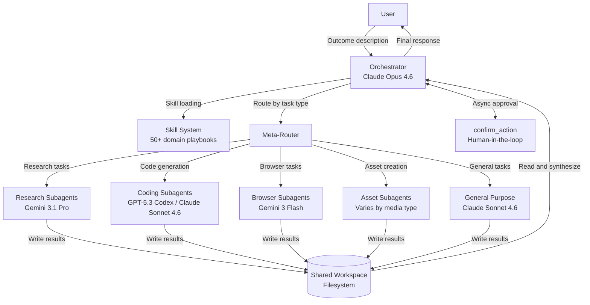
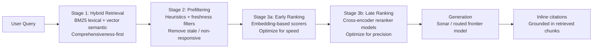

# Perplexity Computer

If you've worked through [Internals](../internals.md) and the [deep dives](../deep-dives/langgraph.md), you now have a precise vocabulary for what happens under the hood of any multi-agent system: the agent loop, tool call serialization, handoff payloads, state checkpointing, and the orchestration tax. This page uses all of that vocabulary to reverse-engineer a production system you can interact with today.

Perplexity Computer is the clearest example of the **orchestrator + specialized subagents** pattern operating at scale. Unlike Claude Code — which is a single sophisticated agent with a rich tool set — Computer runs an active fleet of specialized workers, routes tasks across 19+ models from multiple vendors, and coordinates results through a shared filesystem. Every conceptual layer you read about in [Internals § 4](../internals.md#4-handoffs-under-the-hood) is here in production form.

!!! note "How to Read This Page"
    This page follows the [five-layer methodology](index.md#methodology-the-five-layer-stack) defined in the Production Systems overview. Each section is clearly labeled with evidence quality. **CONFIRMED** blocks contain information from official Perplexity sources or direct observation. **INFERRED** blocks contain reasoned analysis from observable behavior — the kind of inference you should be able to replicate yourself after reading [Internals](../internals.md).

---

## 1. Observable Behavior

### 1.1 Product Overview

!!! success "CONFIRMED"
    Perplexity Computer [launched on February 25, 2026](https://www.perplexity.ai/hub/blog/introducing-perplexity-computer) as a cloud-based agentic AI assistant available exclusively to Perplexity Max subscribers ($200/month). It was extended to Enterprise Max ($325/month) on [March 12, 2026](https://venturebeat.com/technology/perplexity-takes-its-computer-ai-agent-into-the-enterprise-taking-aim-at). Despite its name, there is no physical hardware in the base product — everything runs in the cloud. The exception is **Personal Computer**, a separate offering that uses a dedicated Mac mini as a local file and app interface layer ([Eesel AI](https://www.eesel.ai/blog/perplexity-computer), [CIO Dive](https://www.ciodive.com/news/perplexity-enterprise-ai-browser-tools/814609/)).

Perplexity describes it as *"a general-purpose digital worker that operates the same interfaces you do... capable of creating and executing entire workflows capable of running for hours or even months"* ([Perplexity blog](https://www.perplexity.ai/hub/blog/introducing-perplexity-computer)).

The key design principle distinguishing it from a chatbot: you describe an **outcome**, not a sequence of steps. Computer formulates the strategy, decomposes it into subtasks, assigns them to specialized subagents, and delivers the result.

### 1.2 What the User Sees

!!! success "CONFIRMED"
    The user experience is purely conversational ([Perplexity Computer product page](https://www.perplexity.ai/products/computer), [Forbes](https://www.forbes.com/sites/ronschmelzer/2026/02/27/perplexity-computer-links-ai-agents-to-do-the-work/)). After submitting a task, Computer:

    1. Creates a visible strategy and task plan (checklist) at the start
    2. Spawns subagents to work asynchronously and in parallel
    3. Sends check-in messages when human approval is required
    4. Delivers the final result (documents, apps, data files, reports, dashboards)

    Multiple Computer instances can run simultaneously: *"you can run dozens of Perplexity Computers in parallel"* ([Perplexity blog](https://www.perplexity.ai/hub/blog/introducing-perplexity-computer)). The sandbox is fully cloud-hosted — no local setup, no live preview window, no direct shell access ([Builder.io](https://www.builder.io/blog/perplexity-computer)).

This is the orchestration tax working in your favor: the latency and coordination overhead is acceptable because the tasks are long-running and non-trivial. The same tradeoffs discussed in [Internals § 6](../internals.md#6-the-orchestration-tax) apply — Computer only makes sense for tasks where the baseline single-agent performance would be well below 45%.

### 1.3 Full Tool Inventory

!!! success "CONFIRMED"
    The following tool inventory is sourced from a technical teardown of the system prompt and observed tool calls ([Ajit Singh technical teardown](https://singhajit.com/perplexity-computer-explained/)), cross-referenced with the [Perplexity Sandbox API blog](https://www.perplexity.ai/hub/blog/sandbox-api-isolated-code-execution-for-ai-agents) and [Builder.io review](https://www.builder.io/blog/perplexity-computer).

| Category | Tool | Description |
|---|---|---|
| **Execution** | `bash` | Run shell commands in the Firecracker VM |
| **Execution** | `write` | Create or overwrite a file in the workspace |
| **Execution** | `read` | Read a file from the workspace |
| **Execution** | `edit` | Make targeted string-replacement edits to a file |
| **Execution** | `grep` | Regex search over file contents |
| **Execution** | `glob` | File pattern matching across the workspace |
| **Web Research** | `search_web` | Keyword-based multi-source web search |
| **Web Research** | `search_vertical` | Specialized vertical search (academic, people, image, video, shopping) |
| **Web Research** | `search_social` | Social media and community search |
| **Web Research** | `fetch_url` | Fetch and optionally LLM-extract content from a URL |
| **Web Research** | `screenshot_page` | Capture a rendered screenshot of a webpage |
| **Web Research** | `browser_task` | Multi-step browser automation via cloud browser |
| **Web Research** | `wide_browse` | Parallel browsing across multiple URLs |
| **Web Research** | `wide_research` | Coordinated multi-source deep research sweep |
| **Agents** | `run_subagent` | Spawn a specialized subagent with a task and context |
| **Memory** | `memory_search` | Query the persistent memory store for user context |
| **Memory** | `memory_update` | Store new facts about the user in persistent memory |
| **Scheduling** | `schedule_cron` | Schedule a task to run at a future time or recurrence |
| **Flow Control** | `pause_and_wait` | Pause execution until an async event completes |
| **Safety** | `confirm_action` | Request user approval before a risky action |
| **Safety** | `ask_user_question` | Block and ask the user a clarifying question |
| **External** | Connector tools | 400+ OAuth-managed service connectors (see § 1.6) |

The pre-installed runtime environment includes Python, Node.js, ffmpeg, and standard Unix tools. Additional packages can be installed on request during a session ([Builder.io](https://www.builder.io/blog/perplexity-computer)).

### 1.4 Research Capabilities

!!! success "CONFIRMED"
    Computer performs **seven parallel search types simultaneously** during research tasks: web, academic, people, image, video, shopping, and social ([Eesel AI](https://www.eesel.ai/blog/perplexity-computer)). It reads full source pages — not just snippets — and cross-references findings to identify source disagreements.

    The related Deep Research feature (pre-dating Computer) performs *"dozens of searches, reads hundreds of sources, and reasons through the material autonomously"* with iterative search-read-refine cycles ([Perplexity Deep Research launch](https://www.perplexity.ai/hub/blog/introducing-perplexity-deep-research)).

    All answers carry **inline citations** linking to source documents. The guiding principle is explicit: *"you are not supposed to say anything that you didn't retrieve"* ([ByteByteGo](https://blog.bytebytego.com/p/how-perplexity-built-an-ai-google)).

This citation enforcement distinguishes Computer from every OSS framework — it is baked into the generation architecture, not bolted on via prompt engineering.

**Pro Search vs. Standard Search architecture:**

| Feature | Standard Search | Pro Search |
|---|---|---|
| Retrieval depth | Single-pass, 1–2 sources | Multi-round, dozens of sources |
| Model access | Limited | Claude Sonnet 4.6, GPT-5.2, Gemini 3.1 Pro, Sonar |
| Code interpreter | No | Yes |
| File creation | No | Yes |
| Reasoning models | No | Yes |

Source: [Perplexity Help Center – Pro Search](https://www.perplexity.ai/help-center/en/articles/10352903-what-is-pro-search)

### 1.5 Complex Task Handling

!!! success "CONFIRMED"
    When Computer hits a blocking problem mid-task, it creates new subagents to solve it. These subagents can: find API keys, research supplemental information, write code, or escalate to the user only if truly blocked ([Perplexity blog](https://www.perplexity.ai/hub/blog/introducing-perplexity-computer)).

Documented real-world completions include ([Eesel AI](https://www.eesel.ai/blog/perplexity-computer), [Builder.io](https://www.builder.io/blog/perplexity-computer)):

- Building two micro-applications and four research packets in a single session
- Creating interactive S&P 500 bubble charts with revenue/profit/market cap dimensions
- Running 10 parallel competitor research subagents and synthesizing a summary report
- Generating animated GIFs with time-stamped annotations
- Completing a two-day coding project across dozens of failed builds with coherent context throughout

The `confirm_action` tool provides the structural human-in-the-loop checkpoint: risky actions (sending emails, posting messages, making purchases, deleting files) require explicit user approval before execution ([Ajit Singh teardown](https://singhajit.com/perplexity-computer-explained/)). This maps to the `interrupt()` pattern in [LangGraph's human-in-the-loop](../deep-dives/langgraph.md) — same concept, different implementation.

### 1.6 Connector Ecosystem

!!! success "CONFIRMED"
    Computer ships with 400+ managed OAuth connectors, handling the authentication flow entirely server-side. Code running in the sandbox never sees raw API keys — credentials are injected by an egress proxy keyed by destination domain ([Perplexity Sandbox API blog](https://www.perplexity.ai/hub/blog/sandbox-api-isolated-code-execution-for-ai-agents)).

First-party connectors include: Gmail, Outlook, Slack, GitHub, Linear, Notion, Google Drive, Snowflake, Databricks, Salesforce, and HubSpot ([Computer for Enterprise](https://www.perplexity.ai/help-center/en/articles/13901210-computer-for-enterprise)). Enterprise admins can control which connectors are available to their users.

The extensibility layer uses the **Model Context Protocol (MCP)** — the same open standard used by Claude Code and Cursor. Two modes are supported ([Perplexity Help Center – MCPs](https://www.perplexity.ai/help-center/en/articles/11502712-local-and-remote-mcps-for-perplexity)):

- **Local MCP**: Connects to files, databases, and apps on the user's computer (macOS via Mac App Store). Minimal data sent to Perplexity.
- **Remote MCP**: Server-side connectors supporting OAuth 2.0, API key, or no-auth. Transport: Streamable HTTP or SSE.

The Snowflake connector generates a semantic layer translating natural-language questions into SQL, using `QUERY_HISTORY` and `ACCESS_HISTORY` views to understand schema context ([Snowflake connector setup](https://www.perplexity.ai/help-center/en/articles/14017006-connecting-perplexity-with-snowflake)).

### 1.7 Memory System

!!! success "CONFIRMED"
    Perplexity's persistent Memory feature stores user preferences, interests, and frequently asked question patterns across conversations ([Perplexity Help Center – Memory](https://www.perplexity.ai/help-center/en/articles/10968016-memory)). Memory is dynamically generated by the system based on detected patterns and can be viewed, searched, or deleted in Settings.

Two memory modes:

| Mode | Content |
|---|---|
| **Memories** | Explicit preferences and interests the user has shared |
| **Search history** | Past questions and answers used for contextual relevance |

Memory is disabled in incognito mode and can be toggled off independently. All memory data is encrypted ([Perplexity Help Center – Memory](https://www.perplexity.ai/help-center/en/articles/10968016-memory)).

### 1.8 Scheduled Tasks

!!! success "CONFIRMED"
    The `schedule_cron` tool enables recurring and future-scheduled task execution — effectively making Computer a persistent background worker ([Ajit Singh teardown](https://singhajit.com/perplexity-computer-explained/)). Use cases include daily briefings, recurring research sweeps, automated report generation, and monitoring pipelines.

This is the feature that makes the *"workflows capable of running for hours or even months"* claim literal rather than aspirational.

### 1.9 Consistent Observable Patterns

Across all Perplexity products and Computer specifically, these behaviors are invariant:

- Always searches before answering — no pure generation from training data
- Cites sources inline with numbered references linking to original URLs
- Creates a visible strategy and task checklist before executing
- Spawns specialized subagents for parallel work
- Escalates to the user only when genuinely blocked
- Performs `confirm_action` before any irreversible external action

CTO Denis Yarats described the core design goal: *"orchestration — given a query, how would you answer it perfectly, fast, and cost-efficiently... how would you route this query to an appropriate system?"* ([Gradient Dissent podcast](https://www.youtube.com/watch?v=gvP-DxqatLQ))

---

## 2. Inferred Architecture

The observable behaviors above are consistent with a specific internal architecture. This section describes what the system is probably doing — grounded in official Perplexity technical posts and third-party teardowns, but going beyond what Perplexity has formally confirmed. All claims in this section are labeled clearly.

### 2.1 Overall System Architecture

!!! info "INFERRED — High confidence, supported by multiple independent technical teardowns"
    Perplexity Computer appears to be a **four-layer distributed system** ([Ajit Singh technical teardown](https://singhajit.com/perplexity-computer-explained/)):

```
┌───────────────────────────────────────────────────────────────┐
│  LAYER 1: USER INTERFACE                                      │
│  Web app · Mac app · Slack integration · Comet browser        │
├───────────────────────────────────────────────────────────────┤
│  LAYER 2: CLOUD ORCHESTRATOR                                  │
│  Claude Opus 4.6 (central reasoning engine)                   │
│  Meta-router for model selection across 19+ models            │
│  Persistent memory management                                 │
│  400+ connector coordination via egress proxy                 │
├───────────────────────────────────────────────────────────────┤
│  LAYER 3: ISOLATED EXECUTION (Firecracker microVM)            │
│  2 vCPU · 8 GB RAM · ~20 GB disk                             │
│  FUSE-mounted persistent filesystem                           │
│  Python · Node.js · SQL runtime · ffmpeg                     │
│  Egress proxy intercepts all outbound network calls           │
├───────────────────────────────────────────────────────────────┤
│  LAYER 4: CLOUD BROWSER                                       │
│  Separate browser instance for web automation                 │
│  Different IP/fingerprint from execution sandbox              │
│  screenshot_page · browser_task · wide_browse tools           │
└───────────────────────────────────────────────────────────────┘
```

The separation of Layers 3 and 4 is a deliberate security decision: browser-based attacks (JavaScript injection, fingerprinting, session hijacking) cannot propagate into the code execution environment, and code execution cannot be used to manipulate browser state directly.

### 2.2 The Orchestrator Agent



!!! success "CONFIRMED"
    The orchestrator handles: goal decomposition into discrete subtasks, task-to-model routing decisions, spawning subagents via `run_subagent` calls, managing inter-subagent dependencies, synthesizing subagent outputs, and managing persistent memory state ([Perplexity blog](https://www.perplexity.ai/hub/blog/introducing-perplexity-computer), [Ajit Singh teardown](https://singhajit.com/perplexity-computer-explained/)).

!!! info "INFERRED"
    The orchestrator operates with a **skill system** — loadable instruction sets (`.md` files) that define specialized behavior for task categories. The system auto-selects relevant skills based on query content at the start of each session, similar to a system prompt injection pattern. Skill selection likely uses semantic similarity matching against the user query, not simple keyword matching ([Perplexity Help Center – Computer Skills](https://www.perplexity.ai/help-center/en/articles/13914413-how-to-use-computer-skills)).

### 2.3 Subagent System and Filesystem IPC

!!! success "CONFIRMED"
    Known subagent types and their model assignments ([Ajit Singh technical teardown](https://singhajit.com/perplexity-computer-explained/)):

| Subagent Type | Purpose | Model |
|---|---|---|
| `research` | Web research and multi-source synthesis | Gemini 3.1 Pro |
| `coding` | Code writing and debugging | Claude Sonnet 4.6 |
| `codex_coding` | Specialized code generation | GPT-5.3 Codex |
| `asset` | Document, image, and media creation | Varies by media type |
| `website_building` | Frontend and backend development | Claude Sonnet 4.6 |
| `general_purpose` | Flexible task execution | Claude Sonnet 4.6 |

Two structural constraints are confirmed: (1) the subagent hierarchy is **capped at 2 levels** (orchestrator + children; no grandchildren), and (2) subagents are **stateless by default** — they receive only the task-relevant context slice passed by the orchestrator ([Ajit Singh teardown](https://singhajit.com/perplexity-computer-explained/)).

**Filesystem as IPC**: subagents communicate results back to the orchestrator by writing to shared workspace files. The orchestrator reads these files to synthesize the final response ([Ajit Singh teardown](https://singhajit.com/perplexity-computer-explained/)). This design choice deserves attention.

!!! info "INFERRED"
    The filesystem IPC pattern is a deliberate architectural choice, not a limitation. Compare to the AutoGen pattern (direct message passing) or LangGraph (typed state mutations via reducers): all three accomplish the same thing — moving data between agents — but the filesystem approach provides:

    - **Inspectability**: any file can be read post-hoc for debugging
    - **Scalability**: no token-truncation risk for large return values (the orchestrator reads the file, not a token-limited message)
    - **Decoupling**: subagents don't need to know the orchestrator's context window state
    - **Logging**: every file write is an implicit audit trail

    The 2-level hierarchy cap is a direct consequence of this design: deeper nesting would cause exponential context propagation as the orchestrator must pass increasingly large file-context summaries to nested sub-subagents.

This maps to the [Internals § 4](../internals.md#4-handoffs-under-the-hood) discussion of handoff payloads — but instead of passing `HandoffInputData` structs, Computer uses file paths. The receiving agent's "input" is not a structured object; it is a pointer to a workspace location.

### 2.4 Model Routing (Meta-Router)

!!! success "CONFIRMED"
    A meta-router analyzes each task for intent, complexity, and required capabilities, then routes to the optimal model in milliseconds — invisible to the user ([Digital Applied](https://www.digitalapplied.com/blog/perplexity-computer-multi-model-ai-agent-guide)).

The full model roster includes 19+ models:

| Model | Primary Role |
|---|---|
| Claude Opus 4.6 | Core reasoning, complex orchestration |
| Claude Sonnet 4.6 | General-purpose subagents, coding, website building |
| Claude Haiku 4.5 | Lightweight browser tasks |
| GPT-5.2 | Long-context recall, wide search |
| GPT-5.3 Codex | Specialized code generation and debugging |
| Gemini 3.1 Pro | Deep research, multi-step investigation |
| Gemini 3 Flash | Browser automation, repetitive interactions |
| Grok | Speed-sensitive lightweight tasks |
| Nano Banana 2 | Image generation (internal model) |
| Veo 3.1 | Video generation (Google) |
| ElevenLabs TTS v3 | Voice synthesis |
| Perplexity Sonar variants | Web-grounded Q&A |

Sources: [Perplexity blog](https://www.perplexity.ai/hub/blog/introducing-perplexity-computer), [Ajit Singh teardown](https://singhajit.com/perplexity-computer-explained/), [Eesel AI](https://www.eesel.ai/blog/perplexity-computer)

!!! success "CONFIRMED"
    Perplexity's own data shows that by December 2025, no single model exceeded 25% of total query volume — down from 90% concentrated on two models in January 2025 ([TechCrunch](https://techcrunch.com/2026/02/27/perplexitys-new-computer-is-another-bet-that-users-need-many-ai-models/)). Routing by domain: visual output → Gemini Flash; software engineering → Claude Sonnet 4.5; medical research → GPT-5.1.

This multi-vendor model agnosticism is the clearest articulation of Perplexity's moat. As individual models specialize, the meta-router grows more valuable — the orchestration layer, not any model, is the differentiator. See [Internals § 5](../internals.md#5-why-different-philosophies-exist) for why this philosophy diverges from single-model frameworks.

### 2.5 Isolation and Security (Firecracker)

!!! success "CONFIRMED"
    Each Computer session runs in a dedicated **Firecracker microVM** — the same technology AWS uses for Lambda functions ([Perplexity Sandbox API blog](https://www.perplexity.ai/hub/blog/sandbox-api-isolated-code-execution-for-ai-agents)):

    - Boots in under **125 milliseconds**
    - Hardware-level VM isolation between sessions
    - Specs: 2 vCPUs, 8 GB RAM, ~20 GB disk
    - Managed by a Go binary (`envd`) via gRPC
    - Ephemeral: destroyed at session end

    The filesystem is mounted via **FUSE** — a persistent filesystem daemon intercepts read/write/list operations and translates them. Files persist across session steps and between paused/resumed sessions.

    Sandboxes have **no direct network access**. All outbound requests route through an egress proxy outside the sandbox that injects credentials by destination domain. Code never sees raw API keys or OAuth tokens.

This is hardware-level isolation, not process-level isolation. Docker provides namespace isolation; Firecracker provides actual VM boundaries. The gap matters for multi-tenant cloud environments where a container escape would expose neighboring workloads.

### 2.6 Skill System (Loadable Instruction Modules)

!!! success "CONFIRMED"
    Skills are reusable instruction sets (`.md` files) that function as loadable system prompt extensions — specialized playbooks activated automatically based on query matching ([Perplexity Help Center – Computer Skills](https://www.perplexity.ai/help-center/en/articles/13914413-how-to-use-computer-skills)).

    50+ built-in domain-specific playbooks include: Slides (polished presentations), Research (multi-round methodology with source validation), Charts (data visualization), and domain-specific workflows.

    Users can create custom skills by: (1) describing the task to Perplexity and having it generate the skill, or (2) uploading a `.md` or `.zip` file directly.

```python title="Conceptual skill loading pattern (inferred)"
# Skills are .md files injected into the system prompt before task execution
# The orchestrator loads skills based on semantic similarity to the user query

def load_relevant_skills(user_query: str, skill_library: list[Skill]) -> str:
    # INFERRED: likely semantic similarity, not keyword matching
    relevant = rank_by_similarity(user_query, skill_library)
    return "\n\n".join(skill.content for skill in relevant[:3])

system_prompt = BASE_SYSTEM_PROMPT + "\n\n" + load_relevant_skills(query, SKILLS)
```

### 2.7 Context Management

!!! success "CONFIRMED"
    Context compaction occurs automatically as conversations grow, summarizing prior turns to stay within token limits while maintaining task coherence. Per the Builder.io two-day coding test, context persisted coherently through dozens of failed builds and multiple compactions ([Builder.io](https://www.builder.io/blog/perplexity-computer)).

!!! info "INFERRED"
    Each Computer session manages three distinct state types:

    | State Type | Storage | Persistence |
    |---|---|---|
    | **Working memory** | Orchestrator context window | Within-session only |
    | **Workspace state** | FUSE-mounted filesystem | Across session steps and paused/resumed sessions |
    | **Long-term memory** | Memory system (encrypted) | Across all conversations |

    Context flows in a **hub-and-spoke pattern**: subagents receive only the task-relevant slice of context from the orchestrator, execute independently, and write results to the filesystem. The orchestrator reads filesystem outputs for synthesis. This is why the two-level hierarchy cap exists — deeper nesting would require the orchestrator to pass increasingly large context slices to sub-subagents, defeating the purpose.

    This is architecturally similar to the LangGraph `Send()` fan-out pattern (see [Internals § 4](../internals.md#4-handoffs-under-the-hood)), but without the typed state schema requirement. The filesystem is the implicit state transfer mechanism.

---

## 3. Published / Confirmed Technical Information

### 3.1 Search Engine Architecture

!!! success "CONFIRMED — from Perplexity's own research publication"
    Perplexity built their own search infrastructure after concluding that third-party search APIs were insufficient. The system processes **200 million daily queries** with a median latency of **358ms** (150ms+ ahead of the second-fastest provider) and 95th-percentile latency under **800ms** ([Perplexity research paper — Architecting and Evaluating an AI-First Search API](https://research.perplexity.ai/articles/architecting-and-evaluating-an-ai-first-search-api)).

The search index tracks **over 200 billion unique URLs**, supported by tens of thousands of CPUs, hundreds of terabytes of RAM, and over 400 petabytes in hot storage — processing tens of thousands of indexing operations per second.

**Multi-stage retrieval and ranking pipeline:**



Source: [Perplexity research paper](https://research.perplexity.ai/articles/architecting-and-evaluating-an-ai-first-search-api)

!!! success "CONFIRMED"
    Perplexity uses **Vespa AI** as their search and RAG engine. Vespa was selected for its ability to unify vector search, lexical search, structured filtering, and machine-learned ranking in a single engine — no separate vector database, no BM25 sidecar, no stitching overhead ([ByteByteGo](https://blog.bytebytego.com/p/how-perplexity-built-an-ai-google)).

    The self-improving content understanding module uses frontier LLMs to assess parsing performance and formulate ruleset changes that go through validation before deployment — a feedback loop trained on 200M daily queries ([Perplexity research paper](https://research.perplexity.ai/articles/architecting-and-evaluating-an-ai-first-search-api)).

This search-generation co-design is the most important architectural insight on this page. The retrieval pipeline is not a bolt-on RAG layer — it is trained end-to-end using answer quality signals from live traffic. No DIY configuration can replicate this.

### 3.2 ROSE Inference Engine

!!! success "CONFIRMED"
    Perplexity built a custom in-house inference engine called **ROSE** (Rapid Optimized Serving Engine) ([ByteByteGo](https://blog.bytebytego.com/p/how-perplexity-built-an-ai-google)):

    - Primarily Python with PyTorch for model definitions
    - Critical serving and scheduling components migrating to Rust for C++-comparable performance with memory safety
    - Supports **speculative decoding** and **MTP** (Multi-Token Prediction) decoders for improved latency
    - Runs on NVIDIA H100 GPU clusters on AWS
    - Kubernetes for fleet orchestration

    Perplexity uses **Amazon Bedrock** as a universal adapter to integrate third-party models (OpenAI GPT, Anthropic Claude) without custom integrations per vendor.

CTO Denis Yarats: *"We heavily rely on open source. LLaMA 3 is very useful for us. We've built a training pipeline. A lot of traffic is served on in-house models."* ([Gradient Dissent podcast](https://www.youtube.com/watch?v=gvP-DxqatLQ))

### 3.3 Sonar API

!!! success "CONFIRMED"
    The **Sonar API** is Perplexity's developer-facing API providing web-grounded AI responses — the external version of the core search-and-generation pipeline ([Perplexity Sonar API docs](https://docs.perplexity.ai/docs/sonar/quickstart)).

    Model tiers:

    | Model | Context | Best For |
    |---|---|---|
    | **Sonar** | 128K | Quick grounded Q&A |
    | **Sonar Pro** | 128K | Deeper research, multi-source |
    | **Sonar Reasoning Pro** | 128K | Complex analysis with reasoning |

    The API is **OpenAI-compatible** — the same client libraries work with `model="sonar-pro"`. The **Agent API** (separate from Sonar API) supports structured outputs and third-party models. The **Sandbox API** integrates with the Agent API to enable deterministic code execution mid-workflow.

### 3.4 Sonar Fine-Tuning

!!! success "CONFIRMED — Denis Yarats, CTO"
    Perplexity trains and fine-tunes its own Sonar models on top of open-source base models using proprietary data from user interactions. Fine-tuning focuses on ([ByteByteGo](https://blog.bytebytego.com/p/how-perplexity-built-an-ai-google), [Gradient Dissent podcast](https://www.youtube.com/watch?v=gvP-DxqatLQ)):

    - Summarization quality
    - Citation accuracy and attribution
    - Fact-sticking (staying grounded in retrieved sources, not generating unsupported claims)
    - Query routing optimization (training the meta-router on live query distributions)

### 3.5 CEO/CTO on System Design

!!! success "CONFIRMED — Aravind Srinivas, CEO, UC Berkeley Haas"

> *"The user context system is the most important thing. That's why everyone's working on browser, memory, and all these things — truly understanding the user so that every answer is personalized, actions are taken on your behalf, things can run in the background."*

> *"If you truly want to build an AI knowledge worker, it has to work with the imperfections of the human world and still go do stuff for us. That is an end-to-end system that pulls context across tools, works with imperfections, and reliably does the work for you in the background."*

Source: [UC Berkeley Haas Dean's Speaker Series](https://newsroom.haas.berkeley.edu/deans-speaker-series-perplexity-ai-ceo-aravind-srinivas-phd-21-on-why-he-ditched-pitch-decks/)

!!! success "CONFIRMED — Denis Yarats, CTO, Gradient Dissent"

> *"Our core competency is the orchestration part — given a query, how would you answer it perfectly, fast, and cost efficiently? How would you route this query to the appropriate system? How would you have a smaller model that can do decently well on certain queries and route to that?"*

Source: [Gradient Dissent podcast](https://www.youtube.com/watch?v=gvP-DxqatLQ)

### 3.6 Enterprise Features

!!! success "CONFIRMED"
    Perplexity launched **Computer for Enterprise** at the Ask 2026 developer conference (March 2026), adding ([VentureBeat](https://venturebeat.com/technology/perplexity-takes-its-computer-ai-agent-into-the-enterprise-taking-aim-at), [CIO Dive](https://www.ciodive.com/news/perplexity-enterprise-ai-browser-tools/814609/)):

    - **Slack integration**: Teams can assign tasks to Computer directly from Slack
    - **20 frontier models** across orchestrator and subagent roles
    - **Connector expansion**: Snowflake, Salesforce, SharePoint, Google Drive, and hundreds more
    - **Zero data retention**: Enterprise queries not used for training
    - **Admin controls**: SSO/SAML, SCIM provisioning, connector allowlisting, action logs

### 3.7 Comet Browser

!!! success "CONFIRMED"
    Perplexity launched **Comet**, described as *"the world's first truly AI-native browser,"* with a built-in Comet Assistant agent ([Seraphic Security](https://seraphicsecurity.com/learn/ai-browser/perplexity-comet-browser-key-features-reviews-and-security-tips/)). Features include:

    - Smart address bar accepting both URLs and natural-language queries
    - AI assistant sidebar (lightning bolt icon)
    - **Agentic browsing**: high-level commands executed across websites without manual clicks
    - Voice interface for hands-free operation
    - AI-powered tab previews on hover

    Comet Enterprise launched March 2026. Admins can control domains, enable/disable permissions, and review action logs per browser session ([CIO Dive](https://www.ciodive.com/news/perplexity-enterprise-ai-browser-tools/814609/)).

---

## 4. OSS Analog Mapping

You've now read the [AutoGen deep dive](../deep-dives/autogen.md) and [LangGraph deep dive](../deep-dives/langgraph.md). This section maps Perplexity Computer's architecture to those frameworks, using the dimensions from [Internals § 5](../internals.md#5-why-different-philosophies-exist).

### 4.1 Full Framework Comparison

| Dimension | Perplexity Computer | AutoGen | LangGraph | CrewAI |
|---|---|---|---|---|
| **Orchestration model** | Outcome-driven, fully managed cloud system | Conversation-centric, developer-configured agents | Developer-defined graph (nodes/edges) | Role-based crew with sequential/hierarchical process |
| **Subagent handling** | `run_subagent` tool call; 2-level cap | `UserProxyAgent` + `AssistantAgent` message passing | `Send()` fan-out to worker nodes | Task delegation via hierarchical manager |
| **State management** | Filesystem IPC + context window + memory system | Conversation transcript (in-memory or external DB) | Typed `StateGraph` with checkpoint backends | LanceDB vector store + task output chaining |
| **Search integration** | Native (200B URL Vespa index, sub-400ms) | Plugin via tools (Tavily, Brave, etc.) | Plugin via LangChain tools or MCP | Plugin via tools |
| **Tool calling** | JSON tool calls (same wire format as OpenAI API) | Tool use in agent conversation | Node-level tool binding | Agent-level tool assignment |
| **Memory** | Persistent cross-session (encrypted, user-preference trained) | Conversation transcript; external stores for long-term | Checkpoint-based state persistence | LanceDB semantic recall (cross-run native) |
| **Model routing** | Automatic meta-router across 19+ models | Developer-configured per agent | Developer-configured per node | Developer-configured per agent |
| **Human-in-the-loop** | `confirm_action` / `pause_and_wait` (structural) | `UserProxyAgent` (conversational) | `interrupt()` at graph nodes | Manual checkpoints |
| **Debugging** | Limited (cloud black box) | Full transcript access | LangGraph Studio + visual traces | Timestamped task timeline |
| **Setup** | Zero-config SaaS | Python code configuration | Python code configuration | Python code configuration |
| **Extensibility** | MCP + custom connectors | Custom tool functions | Custom nodes + tools | Custom tools + knowledge bases |

Sources: [DataCamp comparison](https://www.datacamp.com/tutorial/crewai-vs-langgraph-vs-autogen), [Galileo AI comparison](https://galileo.ai/blog/autogen-vs-crewai-vs-langgraph-vs-openai-agents-framework)

### 4.2 Shared Patterns

All four systems implement variants of the same core patterns from [Internals § 1](../internals.md#1-the-agent-loop):

**Orchestrator-worker decomposition**: A coordinator breaks tasks into subtasks, routes them to specialized workers, and synthesizes results. In Perplexity this is the orchestrator + subagent model. In LangGraph it is a supervisor node routing to worker nodes. In AutoGen it is a `GroupChat` with a `GroupChatManager`. In CrewAI it is a manager agent in hierarchical mode.

**Parallel fan-out**: All four support running independent subtasks simultaneously. In LangGraph this is the `Send()` API. In AutoGen it is concurrent agent activation. In Perplexity it is automatic — the orchestrator determines which subagents can run in parallel.

**State passing**: All use some mechanism to pass context between agents. The mechanisms differ: LangGraph uses a typed state schema with reducer functions; AutoGen uses the conversation transcript; CrewAI uses `TaskOutput.raw` string injection; Perplexity uses the filesystem.

**Human-in-the-loop**: All provide checkpoints for human approval. The implementations map cleanly: Perplexity's `confirm_action` ↔ LangGraph's `interrupt()` ↔ AutoGen's `UserProxyAgent` ↔ CrewAI's `human_input: true` on tasks.

### 4.3 Unique Patterns in Perplexity

These capabilities have no direct OSS equivalent:

**Integrated search index**: Perplexity's Vespa-backed 200B+ URL index, co-designed with the generation pipeline, with sub-400ms median latency. OSS alternatives require external API calls (Tavily, Brave, SearXNG) that are slower, less fresh, and lack the tight search-generation feedback loop. This is the gap that cannot be closed by framework choice alone.

**Citation enforcement at the architecture level**: The guiding principle — *"not supposed to say anything you didn't retrieve"* — is enforced in the fine-tuning of Sonar models and the retrieval pipeline design, not via prompt engineering. OSS frameworks leave citation grounding to the developer's prompting skill.

**Task-semantic model routing**: The meta-router routes based on semantic task classification across 19 models from multiple vendors, trained on live query distributions. OSS frameworks require developers to hardcode model assignments or write routing logic manually.

**Managed connector ecosystem**: 400+ OAuth flows handled server-side, with credential injection by the egress proxy. The code never sees secrets. Building equivalent infrastructure for a single service (OAuth flow, token refresh, credential storage) is non-trivial; doing it for 400 services is a multi-year engineering effort.

**Firecracker VM isolation per session**: Hardware-level VM boundaries, not process-level container isolation. This matters for multi-tenant security and eliminates the class of container escape vulnerabilities that affect Docker-based sandboxes.

**Skill system as first-class UX primitive**: Skills as shareable, user-authorable `.md` files that auto-activate based on query content. No OSS framework has an equivalent; the closest analogy is LangChain's prompt templates, but skills include multi-step methodology instructions, not just prompts.

!!! tip "Connection to Orchestration Tax"
    The unique patterns above are also the primary mitigations for the orchestration tax discussed in [Internals § 6](../internals.md#6-the-orchestration-tax). The meta-router reduces error propagation by ensuring the right model handles each subtask (reducing step-level error rate). The filesystem IPC prevents the context window pressure problem that plagues full-history-replay architectures. The 2-level hierarchy cap bounds the error cascade risk documented in [arXiv:2603.04474](https://arxiv.org/html/2603.04474v1) — deeper networks see exponentially higher error infection rates.

---

## 5. DIY Replication Path

This section maps each Perplexity Computer capability to its closest open-source equivalent and explains the gaps you'll encounter. If you've read the [OSS coding models research](../deep-dives/) data, you have the benchmarks to make model selection decisions.

### 5.1 Component Mapping Table

| Perplexity Component | OSS Equivalent | Key Gap |
|---|---|---|
| Orchestrator (Claude Opus 4.6) | Qwen3-235B, Llama 4 Maverick, DeepSeek-V3.2 | No usage-trained meta-router; cold-start routing |
| Meta-router | Rule-based classifier + small LLM | No live query distribution signal; manual heuristics |
| Research subagents | LlamaIndex + Tavily / Brave / Exa | External API; slower; no search-generation co-design |
| Browser subagents | Playwright MCP + fast LLM | Must provision and manage browser infrastructure |
| Coding subagents | Qwen2.5-Coder-32B + E2B sandbox | No GPT-5.3 Codex equivalent in OSS |
| Asset subagents | Claude / GPT via API for quality; SDXL for images | Fragmented; no single model covers all asset types |
| Filesystem IPC | Shared Docker volume or S3 bucket | Same pattern; no gap here |
| Orchestration framework | LangGraph (recommended) or AutoGen | Must define graph structure explicitly |
| Long-term memory | mem0, Zep, or Redis + pgvector | No cross-session learning from usage patterns |
| Citation system | Custom retrieval + prompt engineering | No architecture-level enforcement |
| Search / RAG pipeline | Vespa, Weaviate, or Qdrant + BM25 hybrid | Orders of magnitude smaller index; no freshness SLA |
| Skill system | Loaded `.md` system prompt files | Must author all skills from scratch |
| Connector ecosystem | MCP + custom OAuth flows per service | Each connector requires separate OAuth implementation |
| VM isolation | E2B (managed) or self-hosted Firecracker | E2B = container, not VM; self-hosted Firecracker = complex ops |
| Credential injection | Custom egress proxy or Vault agent | Must build zero-trust credential injection |

### 5.2 Recommended Orchestrator Models

For the orchestrator, you need strong tool-calling, instruction-following, and long-context capability. Based on [benchmark data](../deep-dives/) as of March 2026:

| Model | Size | Context | License | Strengths |
|---|---|---|---|---|
| **Qwen3-235B** | 235B (22B active MoE) | 128K (ext. to 1M) | Apache 2.0 | Best overall OSS; thinking mode; strong tool use |
| **Llama 4 Maverick** | 400B (17B active MoE) | Up to 10M tokens | Llama License | Best for long-context orchestration tasks |
| **DeepSeek-V3.2** | 685B (37B active MoE) | 128K | MIT | Strong tool calling in both thinking/non-thinking modes |
| **Mistral Large 2** | ~123B | 128K | Apache 2.0 | European deployment; strong instruction following |
| **Llama 3.3 70B** | 70B | 128K | Llama License | Lighter orchestrator for budget-constrained setups |

Sources: [HuggingFace open LLMs blog](https://huggingface.co/blog/daya-shankar/open-source-llms), [Till Freitag OSS LLM comparison 2026](https://till-freitag.com/en/blog/open-source-llm-comparison)

For **coding subagents**, the best OSS options:

| Model | SWE-bench Verified | License | Notes |
|---|---|---|---|
| **DeepSeek-V3.1** | 66–68% | MIT | Best OSS SWE-bench as of early 2026; hybrid reasoning |
| **Qwen2.5-Coder-32B** | Moderate | Apache 2.0 | Best per-size code model; strong tool calling |
| **DeepSeek-Coder-V2 (236B)** | Strong | DeepSeek License | Matches GPT-4-Turbo on code; 338 language support |

### 5.3 Search Pipeline Options

| Provider | Type | Quality | Cost | Best For |
|---|---|---|---|---|
| **Tavily** | Managed API | High (AI-optimized, full article extraction) | $0.008/credit | Primary web search; clean JSON; answer extraction |
| **Exa** | Managed API | High (embedding-based semantic) | Varies | RAG retrieval; academic and long-tail queries |
| **Brave Search API** | Managed API | Good (independent index) | $5/1K requests | Privacy-first; non-Google/Bing index |
| **SearXNG** | Self-hosted | Variable (metasearch aggregation) | Infrastructure only | No API limits; privacy; fallback |
| **Perplexity Sonar API** | Managed API | Highest (Perplexity's own index + generation) | $1–15/1M tokens | If you want Perplexity's search without building everything |
| **Firecrawl** | Managed API | High (schema-first extraction) | Per-page flat rate | Structured web extraction; complex pages |

Sources: [Firecrawl OpenClaw search providers guide](https://www.firecrawl.dev/blog/best-openclaw-search-providers), [Linkup SERP API comparison](https://www.linkup.so/blog/best-serp-apis-web-search)

!!! tip "Recommended Combination"
    For highest-quality DIY research: **Tavily** for primary web search + **Exa** for semantic and academic retrieval + **Brave** for volume queries with independent index + **SearXNG** as a self-hosted fallback with no rate limits.

### 5.4 Browser Automation

**Playwright** ([Microsoft](https://playwright.dev)) is the clear choice for a DIY browser layer:

- Supports Chromium, WebKit, and Firefox
- Python, TypeScript, Java, and .NET APIs
- **Playwright MCP** exposes the complete browser state (accessibility tree + interaction tools) to AI agents via MCP — the same protocol Perplexity uses for its connector ecosystem
- Used in GitHub Copilot Coding Agent for browser verification ([Microsoft Developer blog](https://developer.microsoft.com/blog/the-complete-playwright-end-to-end-story-tools-ai-and-real-world-workflows))

Alternatives:

- **browser-use** (OSS): Purpose-built AI browser agent library; higher-level abstraction than Playwright MCP
- **Puppeteer**: Chrome/Chromium only; JavaScript ecosystem
- **Selenium**: More mature; broader language support; slower than modern alternatives

### 5.5 Code Execution Sandboxes

| Tool | Isolation Level | Languages | Notes |
|---|---|---|---|
| **E2B** | Container (managed) | Python, JS, more | Closest managed equivalent; API-based sandboxes; fast spin-up |
| **Modal** | Container (managed) | Python | Great for async/parallel workloads; good Python ML library support |
| **Firecracker** (self-hosted) | MicroVM (hardware) | Any | Exact Perplexity stack; significant operational complexity |
| **Daytona** | Container | Any | Open-source; used by Scira AI (Perplexity OSS clone) |
| **Docker** | Process namespace | Any | Easiest setup; weakest isolation; acceptable for low-trust workloads |

### 5.6 Recommended Framework Choice

!!! info "INFERRED — recommended architecture for DIY Perplexity Computer replication"
    Based on the architectural analysis above, the recommended OSS stack is:

    - **LangGraph** for orchestration: explicit state machine with checkpointing, parallel `Send()` fan-out for subagent spawning, `interrupt()` for human-in-the-loop. This is the closest structural analog to Perplexity's task graph.
    - **Filesystem-based IPC**: mirrors Perplexity's actual subagent communication pattern. Write results to `/workspace/<task_id>/<agent_name>_output.md`; orchestrator reads and synthesizes.
    - **AutoGen for conversational subagent patterns**: where subagents need iterative refinement (write code → execute → fix → retry), AutoGen's conversation model fits naturally.

See [AutoGen deep dive](../deep-dives/autogen.md) and [LangGraph deep dive](../deep-dives/langgraph.md) for implementation details on these frameworks.

### 5.7 Existing OSS Starting Points

!!! success "CONFIRMED"
    **SciraAI** (10,000+ GitHub stars): Open-source AI search tool built with Next.js, Vercel AI SDK, Exa AI for search, Daytona sandbox, Better Auth, Drizzle ORM. AGPLv3 licensed. The closest community-maintained Perplexity Computer analog ([Reddit – Open Source Alternatives to Perplexity](https://www.reddit.com/r/webdev/comments/1oxruai/open_source_alternative_to_perplexity/)).

    **OpenClaw**: Another OSS research agent supporting Firecrawl, Brave, Tavily, Perplexity Sonar, and SearXNG as interchangeable search providers. Uses MCP for tool integration ([Firecrawl OpenClaw guide](https://www.firecrawl.dev/blog/best-openclaw-search-providers)).

### 5.8 What You Lose vs. the Commercial Product

| Capability | Perplexity Computer | DIY Gap |
|---|---|---|
| **Search index quality** | 200B+ URLs, 358ms median latency, co-designed with generation | External APIs: slower, less fresh, no search-generation feedback loop |
| **Citation grounding** | Architecture-level enforcement via fine-tuned Sonar models | Requires prompt engineering; easier to hallucinate |
| **Model routing quality** | Meta-router trained on 200M daily queries | Cold-start; no usage signal; manual heuristics |
| **Managed connectors** | 400+ OAuth flows server-side; zero secret exposure in code | Must implement OAuth per service; significant engineering overhead |
| **VM isolation** | Firecracker: hardware-level, boots <125ms | Docker: process-level; E2B: managed but container-based |
| **Skill ecosystem** | 50+ curated, tested playbooks | Author from scratch |
| **Memory system** | Encrypted, cross-session, trained on usage patterns | Basic vector store; no pattern learning |
| **Credential security** | Zero-trust egress proxy; code never sees secrets | Manual secret management |
| **Multi-vendor model access** | Unified billing, routing, and fallback across 19+ models | Separate API keys, rate limits, and billing per vendor |
| **Enterprise compliance** | SOC 2 Type II, SSO/SAML, SCIM, zero data retention | Must build or integrate separately |

### 5.9 Minimal Viable Stack Diagram

```
┌─────────────────────────────────────────────────────────────────┐
│  USER INTERFACE: Next.js chat UI or Gradio                      │
├─────────────────────────────────────────────────────────────────┤
│  ORCHESTRATOR: LangGraph + Qwen3-235B or Llama 4 Maverick       │
│  ├── Task decomposition node                                    │
│  ├── Meta-router node (rule-based + small classifier LLM)       │
│  ├── Memory node (mem0 or Redis + pgvector)                     │
│  └── Synthesis node                                             │
├─────────────────────────────────────────────────────────────────┤
│  SUBAGENTS (LangGraph Send() fan-out):                          │
│  ├── Research agent: Tavily + Exa + Qwen3-235B                  │
│  ├── Coding agent: Qwen2.5-Coder-32B + E2B sandbox             │
│  ├── Browser agent: Playwright MCP + Gemini Flash / Claude      │
│  └── Asset agent: Claude / GPT via API                          │
├─────────────────────────────────────────────────────────────────┤
│  EXECUTION SANDBOX: E2B or Docker                               │
│  FILESYSTEM IPC: Shared volume (/workspace/<session_id>/)       │
├─────────────────────────────────────────────────────────────────┤
│  SEARCH/RAG: Tavily + Exa + BM25 hybrid reranker               │
│  BROWSER AUTOMATION: Playwright MCP                             │
│  CONNECTORS: Custom MCP servers per service                     │
└─────────────────────────────────────────────────────────────────┘
```

### 5.10 Cost Considerations

!!! warning "The Cost Reality"
    Perplexity Computer at $200/month for Max (unlimited usage) is almost certainly subsidized at launch to drive adoption. A DIY stack running comparable workloads at API rates will be significantly more expensive per task for complex multi-subagent workflows.

    Reference points from [Internals § 6](../internals.md#6-the-orchestration-tax): multi-agent at ~$0.08/request vs. single-agent at ~$0.03/request — a **2.7× cost multiplier** even for simple orchestration. For a 10-subagent parallel research sweep, each subagent reading 20 full source pages, the input token cost alone reaches $2–5/query at current frontier model rates.

    The DIY path makes sense when: (1) you need customization Perplexity doesn't expose, (2) you have data privacy requirements preventing cloud processing, or (3) you're building a product that resells the capability at a margin. For personal productivity use, the commercial product is almost certainly cheaper at volume.

```python title="Rough cost calculation for a 10-subagent research task"
# Approximate cost for a parallel research sweep
# Using Tavily + Claude Sonnet 4.5 at March 2026 pricing

TAVILY_COST_PER_SEARCH = 0.008       # $0.008/credit
SONNET_INPUT_COST_PER_1M = 3.00      # $3/M input tokens
SONNET_OUTPUT_COST_PER_1M = 15.00    # $15/M output tokens

searches_per_agent = 5
agents = 10
tokens_per_search_result = 4_000     # ~4K tokens per full-page fetch
output_tokens_per_agent = 2_000      # ~2K token synthesis per agent
orchestrator_tokens = 20_000         # orchestrator context + synthesis

search_cost = searches_per_agent * agents * TAVILY_COST_PER_SEARCH
input_tokens = agents * searches_per_agent * tokens_per_search_result + orchestrator_tokens
output_tokens = agents * output_tokens_per_agent + 3_000  # + final synthesis

input_cost = (input_tokens / 1_000_000) * SONNET_INPUT_COST_PER_1M
output_cost = (output_tokens / 1_000_000) * SONNET_OUTPUT_COST_PER_1M

total = search_cost + input_cost + output_cost
# Result: ~$0.40–$1.20 per deep research task
# At 100 tasks/month → $40–120/month (before infrastructure)
print(f"Estimated cost: ${total:.2f} per deep research task")
```

---

## Key Architectural Takeaways

After reverse-engineering this system through the five layers, seven architectural insights stand out:

1. **Filesystem as communication bus**: Subagents communicate results via shared workspace files, not direct message passing. This trades some coordination complexity for inspectability, decoupling, and freedom from token-size constraints on return values.

2. **Two-level hierarchy cap**: The orchestrator spawns subagents; subagents cannot spawn their own children. This prevents exponential context propagation — a direct engineering response to the cascade dynamics described in [arXiv:2603.04474](https://arxiv.org/html/2603.04474v1) (see [Internals § 6](../internals.md#6-the-orchestration-tax)).

3. **Four-layer separation of concerns**: User interface → cloud orchestrator → isolated execution VMs → cloud browser. The browser layer's isolation from the execution layer is a security decision, not an incidental design.

4. **Skills as system prompt injection**: Skills are `.md` files loaded at task start based on query matching — a lightweight, file-based approach to behavioral specialization that requires zero infrastructure changes.

5. **Model agnosticism as a strategic moat**: Perplexity's value is in the orchestration and routing layer, not any single model. By December 2025, no model exceeded 25% of query volume. As models specialize further, the meta-router's value increases.

6. **Search-generation co-design**: The retrieval pipeline is trained end-to-end using answer quality signals from 200M daily queries. This is the gap that no DIY combination of external search APIs can close — it requires scale and a closed feedback loop between retrieval and generation.

7. **MCP as the extensibility primitive**: Both directions — Perplexity exposing its search to other clients via the Perplexity MCP Server, and Computer consuming external services via MCP connectors — use the same open protocol. This is the right long-term bet for an ecosystem that includes Claude Code, Cursor, and Codex as peer agents.

---

*This page is part of the [Production Systems](index.md) section. See also: [Claude Code](claude-code.md) for the single-agent architecture contrast. For framework implementation details, see the deep dives on [AutoGen](../deep-dives/autogen.md) and [LangGraph](../deep-dives/langgraph.md). For the raw mechanics underlying both, see [Internals](../internals.md).*
