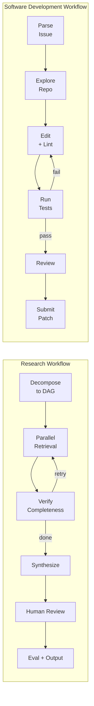

# Full Workflow: From Task to Output

This page walks through two complete end-to-end multi-agent workflows — one for research and one for software development. The goal is to show what data actually moves between agents at each step: not just the high-level topology, but the concrete JSON structures, control signals, and failure modes that appear in production systems.

---

## Research Workflow: Producing a Technical Summary

**Concrete example task:** *"Produce a technical summary of memory architectures in multi-agent systems"*

This workflow follows the [VMAO (Verified Multi-Agent Orchestration)](https://arxiv.org/html/2603.11445v2) pattern combined with the [Egnyte deep research agent architecture](https://www.egnyte.com/blog/post/inside-the-architecture-of-a-deep-research-agent/), which represents the current state of the art for production research agents.

---

### Step 1: Task Decomposition

The Planner Agent receives the raw query and converts it into a **directed acyclic graph (DAG) of sub-questions** before any retrieval begins. This is the most consequential step: the structure of the DAG determines what gets researched, in what order, and by which specialized agents.

The [Egnyte architecture](https://www.egnyte.com/blog/post/inside-the-architecture-of-a-deep-research-agent/) adds a preliminary step — the Planner first invokes a Searcher Agent for broad foundational knowledge, synthesizes a "Topic Analysis" (problem statement + key research angles), and *then* generates the DAG. The DAG is presented to the human for review before dispatch (see [Step 5](#step-5-human-review-gate)).

The [VMAO framework](https://arxiv.org/html/2603.11445v2) formalizes the sub-question structure as a JSON array. Each node in the DAG carries:

```json
{
  "id": "sq_001",
  "question": "What are the dominant memory architecture types used in multi-agent LLM systems?",
  "agent_type": "architecture_survey",
  "dependencies": [],
  "priority": 9,
  "context_from_deps": false,
  "verification_criteria": "Names ≥3 distinct architecture types with citations"
}
```

```json
{
  "id": "sq_003",
  "question": "How do shared vs. private memory models affect inter-agent coordination?",
  "agent_type": "coordination_analysis",
  "dependencies": ["sq_001", "sq_002"],
  "priority": 7,
  "context_from_deps": true,
  "verification_criteria": "Covers both shared and private; includes at least one coordination failure example"
}
```

**Planning prompt rules from [VMAO](https://arxiv.org/html/2603.11445v2)** (actual excerpt):

```
– RAG First: Always search internal knowledge base first or in parallel
– Maximize Parallelism: Execute independent questions simultaneously
– Minimize Dependencies: Only when results feed into other questions
– Be Specific: Clear, answerable scope for each question
Output: JSON with sub_questions array and explanation
```

!!! tip "Why DAG over flat list?"
    A flat list of parallel questions cannot express that "compare memory models" depends on first understanding what those models are. The DAG encodes this ordering explicitly, enabling the scheduler to release questions in topological waves — all independent questions run concurrently, dependent questions wait only for their direct predecessors.

---

### Step 2: Parallel Retrieval

Once the DAG is approved, the scheduler performs a **topological sort** and dispatches all root-level (zero-dependency) sub-questions concurrently to independent Researcher Agent instances. This is the fan-out/fan-in (scatter-gather) pattern.

From the [Egnyte architecture](https://www.egnyte.com/blog/post/inside-the-architecture-of-a-deep-research-agent/), the master agent's main loop:

```
1. Schedule: topological traversal of DAG → find all "ready" nodes
2. Dispatch: run N Researcher Agent instances concurrently (map/reduce)
3. Synchronize: collect structured Question Analysis reports
4. Loop: back to (1) until all DAG nodes processed
```

Each Researcher Agent uses a **multi-pronged query strategy** to avoid single-source bias:

- **Question deconstruction** — break the sub-question into 3–5 focused search queries
- **Keyword deepening** — surface domain terms from prior findings to improve recall
- **Gap-driven queries** — explicitly target gaps identified in previous retrieval rounds

After retrieval, results are reranked (cross-encoder), semantically chunked with Maximum Marginal Relevance applied for diversity, and completeness is evaluated before proceeding.

The result of each researcher's work is a structured **sub-question result object**:

```json
{
  "id": "sq_001",
  "question": "What are the dominant memory architecture types used in multi-agent LLM systems?",
  "agent_type": "architecture_survey",
  "status": "complete",
  "completeness_score": 0.91,
  "findings": "Three dominant types emerge: (1) shared vector store with namespace isolation, (2) per-agent episodic memory with selective broadcast, (3) external graph-based memory...",
  "sources": [
    "https://arxiv.org/abs/2309.02427",
    "https://arxiv.org/html/2603.11445v2"
  ],
  "identified_gaps": [
    "No data on memory access latency at scale"
  ],
  "verification_status": "complete"
}
```

!!! info "Fan-out cost math"
    [Philippe Habra's analysis](https://www.linkedin.com/posts/philippe-habra-68410510a_this-post-is-not-for-everyoneits-only-activity-7435362010520891392-Rgrq) puts it clearly: 3 agents × 4 sec each = 12 sec sequential vs. ~4 sec parallel + synthesis time. The tradeoff: cost multiplies linearly with agent count, and synthesis difficulty grows nonlinearly as contradictory results accumulate.

---

### Step 3: Verification

After each execution wave, the **LLM Verifier** evaluates the collected results before releasing the next wave of the DAG or proceeding to synthesis. This is the critique/review pattern described by [Google Cloud Architecture Center](https://docs.cloud.google.com/architecture/choose-design-pattern-agentic-ai-system).

The [VMAO Verifier](https://arxiv.org/html/2603.11445v2) checks five criteria against each sub-question result:

```
– Completeness:    All aspects of the question addressed?
– Evidence Quality: Multiple sources? Cross-referenced?
– Metadata:        Source attribution (filename/URL/date) present?
– Specificity:     Concrete facts/numbers vs. vague claims?
– Contradictions:  Conflicts between sources flagged?
```

The verification output structure:

```json
{
  "verification_status": "partial",
  "completeness_score": 0.72,
  "missing_aspects": [
    "No coverage of memory persistence across sessions",
    "Retrieval latency benchmarks absent"
  ],
  "contradictions": [
    "sq_002 claims shared memory degrades with >10 agents; sq_004 cites system achieving 50-agent coherence"
  ],
  "confidence": 0.68,
  "recommendation": "retry",
  "retry_queries": [
    "multi-agent memory persistence cross-session",
    "shared memory scalability benchmarks LLM agents"
  ]
}
```

**Stop conditions** — the system proceeds to synthesis when any of these thresholds are met ([VMAO](https://arxiv.org/html/2603.11445v2)):

| Condition | Threshold |
|---|---|
| Completeness threshold | ≥80% of sub-questions answered |
| Diminishing returns | <5% improvement over last iteration |
| Token budget | 1M tokens consumed |
| Maximum iterations | 3 verification cycles |

---

### Step 4: Synthesis

Synthesis is sequential and performed by a single **Writer Agent** — parallelizing synthesis introduces redundancy and contradictions that cost more to resolve than they save in time. The [Egnyte architecture](https://www.egnyte.com/blog/post/inside-the-architecture-of-a-deep-research-agent/) explicitly separates the synthesis agent from all retrieval agents.

The Writer Agent's three-stage process:

1. **Holistic outline** — meta-analysis of all Question Analysis reports to identify *emergent overarching themes* (not just answers to individual sub-questions). Output: a report section structure.
2. **Parallel section generation** — each theme section is generated independently (this is safe to parallelize because sections are distinct). A high-quality model generates each section.
3. **Final assembly** — sections combined with pre-written introduction and conclusion; source attributions verified.

For large result sets (>15K characters or 10+ sub-question results), [VMAO](https://arxiv.org/html/2603.11445v2) applies **hierarchical synthesis**:

```
1. Group results by agent_type
2. Synthesize within each group → condensed group summary
3. Integrate group summaries into final answer with source attribution
```

!!! tip "Model specialization"
    Production systems documented in the [Egnyte architecture](https://www.egnyte.com/blog/post/inside-the-architecture-of-a-deep-research-agent/) use a cheaper/faster model for per-section analytical subtasks and a stronger frontier model for final report assembly. This significantly reduces cost without degrading output quality.

---

### Step 5: Human Review Gate

Before the final report is delivered, execution pauses for human review. This is implemented via **LangGraph's `interrupt()` mechanism**, the standard production implementation documented in the [LangChain Blog on human-in-the-loop agents](https://blog.langchain.com/making-it-easier-to-build-human-in-the-loop-agents-with-interrupt/).

When a node calls `interrupt(payload)`:

1. Graph execution pauses at that node
2. Thread is marked as `interrupted`
3. Payload is stored in the persistence layer (checkpointer)
4. Caller inspects `result["__interrupt__"]`
5. Human provides input via `graph.invoke(Command(resume=decision), config=config)`
6. Graph resumes from the same node; `interrupt()` returns the human's decision

**Concrete interrupt payload** for a research review gate:

```python
human_decision = interrupt({
    "kind": "review_research_report",
    "draft_sections": ["Architecture Types", "Coordination Mechanisms", "Failure Modes"],
    "completeness_score": 0.84,
    "identified_gaps": ["No coverage of memory persistence cross-session"],
    "instructions": "Approve as-is | return {'action': 'edit', 'section': ..., 'feedback': ...} | return {'action': 'reject', 'reason': ...}"
})
```

[Towards Data Science: LangGraph 201](https://towardsdatascience.com/langgraph-201-adding-human-oversight-to-your-deep-research-agent/) documents two standard checkpoint positions in research workflows:

- **After `generate_query`** — human reviews proposed search queries before any retrieval
- **After `reflection`** — human reviews sufficiency assessment and proposed follow-up queries

Three response patterns are supported:

| Pattern | Mechanism | When Used |
|---|---|---|
| **Approve** | `Command(resume={"action": "approve"})` | Draft meets requirements |
| **Reject** | `Command(resume={"action": "reject", "reason": "..."})` | Fundamental issues; restart |
| **Edit state** | `Command(resume={"action": "edit", "feedback": "..."})` | Minor corrections; continue |

---

### Step 6: Eval Check → Final Output

After human approval, the draft passes through an automated quality gate before delivery. See [evals.md](evals.md) for the full evaluation architecture.

The quality gate combines:

- **Deterministic checks** — citation format validation, section completeness, minimum source count, no broken URLs
- **LLM-as-judge scoring** — the report is scored against a rubric covering factual accuracy, coherence, depth, and coverage of the original query

Only reports that clear both checks are delivered. Failed reports are routed back to the Verifier with a structured failure report, triggering a targeted retry on the failing dimensions.

---

### Common Failure Points

The following failure modes and recovery patterns are documented from production research agent deployments, primarily the [VMAO framework](https://arxiv.org/html/2603.11445v2) and [Egnyte architecture](https://www.egnyte.com/blog/post/inside-the-architecture-of-a-deep-research-agent/):

| Failure | Root Cause | Recovery Pattern |
|---|---|---|
| Empty retrieval | Wrong query terms; sparse knowledge base | Confidence-gated retry; agentic RAG loop ("Is this context sufficient? No? Retrieve again.") |
| Contradictory parallel results | Different sources disagree on facts | Verifier flags contradiction; retry with targeted disambiguation queries |
| Context window overflow at synthesis | Too many sub-question results (>15K chars) | Hierarchical synthesis: group → summarize group → integrate summaries |
| DAG dependency deadlock | Circular dependency in planning | DAG validation at planning time; topological sort catches cycles before dispatch |
| Cost overrun | Too many parallel agents × LLM calls | Configurable stop conditions (1M token budget, 3 max iterations) |
| Silent quality degradation | No feedback loop on output quality | Closed-loop schema lifecycle with rubric scoring ([Governed Memory architecture](https://arxiv.org/html/2603.17787v1)) |
| Partial fan-out failure | One sub-agent fails mid-batch | Retry individual failed sub-questions; partial results still contribute to synthesis |
| Planning over-decomposition | DAG is too granular (>15 nodes) for the query | Human review gate at planning stage catches this before retrieval begins |

---

## Software Development Workflow: Fixing a Failing Test

**Concrete example task:** *"Fix a failing test in a Python repository"*

This workflow follows the [SWE-agent pattern (Yang et al., Princeton 2024)](https://arxiv.org/abs/2405.15793), which introduced the Agent-Computer Interface (ACI) concept and demonstrated that interface design — not model capability — is the primary driver of software engineering agent performance.

---

### Step 1: Issue Parsing

The agent receives a GitHub issue as its sole input. There is no structured pre-processing step — the LM reads the issue text and extracts relevant entities directly into its internal reasoning trace.

What the agent extracts:

- **Affected component** — module name, file path hints, class or function mentioned
- **Error messages** — full traceback if present in the issue body
- **Reproduction steps** — commands or test cases that trigger the failure
- **Expected vs. actual behavior** — the delta the patch must close

Based on the [SWE-agent paper](https://arxiv.org/abs/2405.15793) and [The Pragmatic Engineer's analysis of AI coding agents](https://newsletter.pragmaticengineer.com/p/ai-coding-agents), agents that create a reproduction script at this stage (before any editing) perform significantly better, because they can verify their patch independently of the original test suite.

---

### Step 2: Repository Exploration (Localization)

Before any edits, the agent must locate the relevant code. This is the **ACI pattern** introduced in the [SWE-agent paper](https://arxiv.org/abs/2405.15793): the agent has access to a purpose-built Agent-Computer Interface rather than raw bash, because LM agents are a distinct category of end user with different interface needs than human engineers.

The typical localization trajectory — described in the paper as "zooming in":

```
find_file "memory_store.py"
→ search_dir "MemoryStore" src/
→ open src/agents/memory_store.py 42
→ goto 187
```

**Full SWE-agent command table** ([SWE-agent ACI documentation](https://swe-agent.com/0.7/background/aci/), [NeurIPS 2024 paper](https://proceedings.neurips.cc/paper_files/paper/2024/file/5a7c947568c1b1328ccc5230172e1e7c-Paper-Conference.pdf)):

**Search and Navigation:**

| Command | Arguments | What it does |
|---|---|---|
| `find_file` | `<filename>` | Searches for files matching filename in repo |
| `search_file` | `<string> [file]` | Searches for string within a file (or open file) |
| `search_dir` | `<string> [dir]` | Searches string across a directory; returns ≤50 results |

**File Viewer:**

| Command | Arguments | What it does |
|---|---|---|
| `open` | `<filepath> [line_num]` | Opens file in interactive viewer; shows 100 lines at a time with line numbers |
| `scroll_down` | — | Scrolls viewer window down one page |
| `scroll_up` | — | Scrolls viewer window up one page |
| `goto` | `<line_num>` | Jumps to specific line in the open file |

**File Editor:**

| Command | Arguments | What it does |
|---|---|---|
| `edit` | `<start_line>:<end_line> <replacement>` | Replaces lines start–end; runs linter; rejects if syntax error; auto-shows updated file |
| `create` | `<filepath>` | Creates a new file |

**Context / Control:**

| Command | Arguments | What it does |
|---|---|---|
| `submit` | — | Generates git diff (patch file) and exits |

**ACI design principles** from the [SWE-agent paper](https://arxiv.org/abs/2405.15793):

1. **Simple and easy to understand** — few options per command, concise documentation; no 40-flag bash commands
2. **Compact and efficient** — important operations consolidated; one action does what would require three bash commands
3. **Informative but concise feedback** — after an edit, the updated file is shown automatically; empty output gets explicit confirmation rather than silence

---

### Step 3: Patch Generation

The agent uses the `edit` command to modify specific line ranges. The interface enforces correctness at write time:

- The replacement text is validated by a linter immediately
- **Invalid edits are discarded, not applied** — the agent sees the linter error as feedback and must retry
- After a successful edit, the file viewer automatically shows the updated content around the edit site — no separate `open` or `cat` needed

This design is quantifiably important: [ablation studies in the NeurIPS 2024 paper](https://proceedings.neurips.cc/paper_files/paper/2024/file/5a7c947568c1b1328ccc5230172e1e7c-Paper-Conference.pdf) found that removing the custom `edit` command and falling back to bash (`sed`, `cat >`) caused a **10.7 percentage point performance drop**.

!!! warning "Linter validation is load-bearing"
    The linter catches syntax errors immediately, preventing a common failure mode where an agent applies a broken patch, runs tests, sees test failures unrelated to its edit, and spends multiple turns debugging the wrong thing. Python indentation errors are the most frequent trigger.

After editing, the agent verifies by scrolling through the modified file to confirm the change looks correct in context.

---

### Step 4: Test Execution

```bash
python -m pytest tests/test_memory_store.py -v
```

The test output (stdout/stderr) is returned as the next environment observation. If tests fail, the agent reads the failure message and loops back to Step 3.

Per the [SWE-agent paper's trajectory analysis](https://proceedings.neurips.cc/paper_files/paper/2024/file/5a7c947568c1b1328ccc5230172e1e7c-Paper-Conference.pdf), the edit-test loop is where most turns are spent. Action frequency by phase:

```
Exploration (turns 1–4):  find_file, search_dir, search_file, open, goto
Edit-test loop (turns 3+): edit, python3/pytest (interleaved, multiple cycles)
Submission (~turn 10):    submit
```

Each test failure gives the agent concrete information: the failing assertion, the line number, and the actual vs. expected values. This structured feedback drives convergence faster than re-reading the issue.

---

### Step 5: Review Agent (or Human Review)

Once tests pass, the patch enters a review stage. Two implementations exist in production:

**Automated review (OpenHands security model):** The [OpenHands SDK](https://arxiv.org/html/2511.03690v1) implements risk-rated tool calls as a first-class concept. Every action is classified LOW/MEDIUM/HIGH/UNKNOWN risk. Actions above a configured threshold are held for explicit human confirmation before execution. This gate applies throughout the workflow, not just at submission.

**Human review gate:** Using the same LangGraph `interrupt()` mechanism as the research workflow, execution can pause pre-submission to allow human inspection of the diff. The reviewer sees:

```json
{
  "kind": "review_patch",
  "diff": "--- a/src/agents/memory_store.py\n+++ b/src/agents/memory_store.py\n...",
  "tests_passed": ["test_memory_store.py::test_write_read", "test_memory_store.py::test_eviction"],
  "files_changed": ["src/agents/memory_store.py"],
  "instructions": "Approve or provide rejection reason"
}
```

---

### Step 6: Commit

Approval triggers the `submit` command, which:

1. Generates a `git diff` of all changes since the base commit
2. Writes the diff as a patch file
3. Exits the agent session

From the [SWE-agent paper](https://arxiv.org/abs/2405.15793), the median submission occurs at **turn ~10**. Agents that do not submit by turn 10 tend to keep editing until they exhaust their budget, suggesting that early confident submission correlates with genuine resolution while extended loops often indicate the agent is stuck.

---

### Where Evals Fit

Software development agents are evaluated against **SWE-bench**, whose harness architecture is documented at [swebench.com](https://www.swebench.com/SWE-bench/guides/evaluation/):

```
┌─────────────────────────┐
│   Instance Images        │  Problem-specific configs (per GitHub issue)
├─────────────────────────┤
│   Environment Images     │  Repo-specific dependencies
├─────────────────────────┤
│   Base Images            │  Language + tooling (Python 3.x, pytest)
└─────────────────────────┘
```

**Eval process:**

1. **Setup** — build Docker image for the specific issue instance
2. **Patch application** — apply the model-generated patch to the repository
3. **Test execution** — run the test files modified in the original PR
4. **Grading** — if `fail-to-pass` tests now pass → instance resolved
5. **Reporting** — aggregate `% Resolved` rate across the benchmark

**Known weakness:** SWE-bench only runs tests in PR-modified test files, not the full test suite. A [2025 ICSE study](https://software-lab.org/publications/icse2026_SWE-bench-correctness.pdf) found that **7.8% of "correct" patches** (patches that pass the benchmark eval) actually fail the full developer test suite, and 29.6% show behavioral differences from the ground-truth patch.

Some advanced harnesses — including [Anthropic's long-running agent harness](https://www.anthropic.com/engineering/effective-harnesses-for-long-running-agents) — experiment with running partial test suites *inside* the agent loop to guide editing decisions, but this is not yet standard.

See [evals.md](evals.md) for full benchmark methodology and cross-system comparisons.

---

### Common Failure Modes

From the [SWE-agent paper's failure analysis](https://proceedings.neurips.cc/paper_files/paper/2024/file/5a7c947568c1b1328ccc5230172e1e7c-Paper-Conference.pdf):

| Failure Mode | Description | Root Cause |
|---|---|---|
| Incorrect implementation | Patch changes the right file but wrong logic | Misunderstood issue; no reproduction script created |
| Wrong file | Agent edits unrelated file | Issue description vague; search queries too broad |
| Premature submission | `submit` called before tests pass | Budget pressure; agent confidence miscalibration |
| Edit error loop | Linter error retried with same broken edit | Edit structure misunderstood; cascading indentation errors |
| Partial patch | Only one of several required files changed | Multi-file issue not recognized during localization |
| Tests not run | Agent submits after visual diff check only | False confidence from inspecting the diff without executing |

---

## Workflow Comparison Diagram

Both workflows share a decompose-execute-verify-review spine, but differ fundamentally in their execution model: the research workflow is multi-agent and parallel; the SWE workflow is single-agent and iterative.



### Side-by-Side Comparison

| Dimension | Research Workflow | Software Development Workflow |
|---|---|---|
| **Input** | Natural language query | GitHub issue (bug report or feature request) |
| **Output** | Structured technical report with citations | Git patch file (diff) |
| **Decomposition strategy** | DAG of sub-questions with typed agent assignments ([VMAO](https://arxiv.org/html/2603.11445v2)) | No decomposition; single agent explores and edits sequentially |
| **Parallelism** | High — independent sub-questions run concurrently across N agents | Low — single agent loop; sequential edit-test cycles |
| **Iteration pattern** | Verification-gated waves: retrieve → verify → retrieve or synthesize | Edit-test loop: edit → run tests → edit until pass |
| **Eval method** | LLM-as-judge + deterministic citation/coverage checks | SWE-bench automated test harness ([swebench.com](https://www.swebench.com/SWE-bench/guides/evaluation/)) |
| **Human-in-loop** | LangGraph `interrupt()` at planning and post-synthesis ([LangChain Blog](https://blog.langchain.com/making-it-easier-to-build-human-in-the-loop-agents-with-interrupt/)) | Optional review gate pre-submission; OpenHands risk-rated confirmation |
| **Typical duration** | Minutes to hours depending on DAG depth and token budget | Median ~10 agent turns; seconds to minutes |
| **Common failure mode** | Contradictory parallel results; context overflow at synthesis | Premature submission; edit-linter loops; wrong file localized |
| **State management** | LangGraph shared `StateGraph` TypedDict with checkpointing | SWE-agent ACI history processor; OpenHands append-only event log |
| **Model strategy** | Cheap model for subtasks, strong model for final assembly | Single model throughout; model choice affects localization quality |
